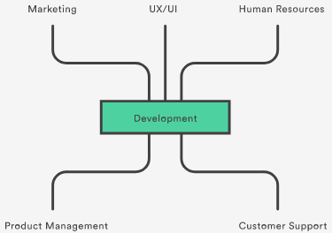
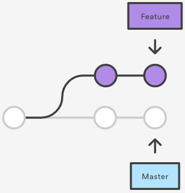
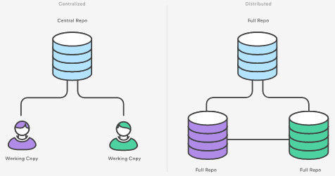
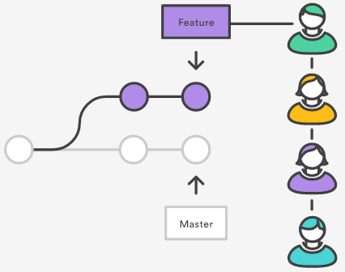
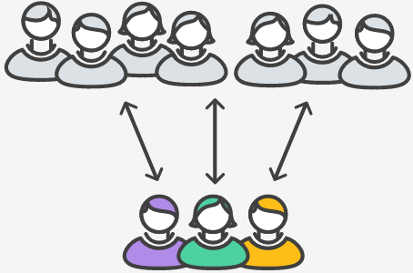
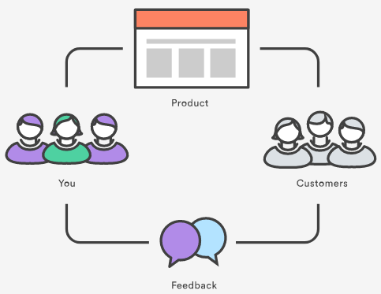
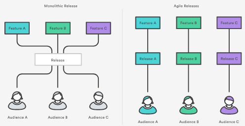
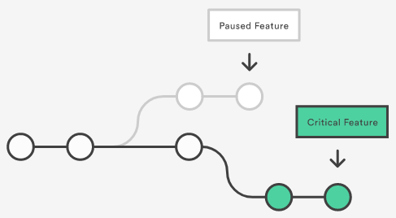
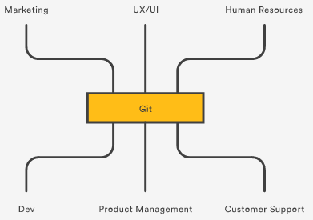

## Why Git for your organization

Switching from a centralized version control system to Git changes the way your development team creates software. And, if you’re a company that relies on its software for mission-critical applications, altering your development workflow impacts your entire business.

In this article, we’ll discuss how Git benefits each aspect of your organization, from your development team to your marketing team, and everything in between. By the end of this article, it should be clear that Git isn’t just for [agile software development](https://www.atlassian.com/agile/developer)—it’s for agile business.

### Git for developers

#### Feature Branch Workflow

One of the biggest advantages of Git is its branching capabilities. Unlike centralized version control systems, Git branches are cheap and easy to merge. This facilitates the feature branch workflow popular with many Git users.

Feature branches provide an isolated environment for every change to your codebase. When a developer wants to start working on something—no matter how big or small—they create a new branch. This ensures that the master branch always contains production-quality code.

Using feature branches is not only more reliable than directly editing production code, but it also provides organizational benefits. They let you represent development work at the same granularity as the your [agile backlog](https://www.atlassian.com/agile/backlogs). For example, you might implement a policy where each [Jira](https://www.atlassian.com/software/jira) ticket is addressed in its own feature branch.

#### Distributed Development

In SVN, each developer gets a working copy that points back to a single central repository. Git, however, is a distributed version control system. Instead of a working copy, each developer gets their own local repository, complete with a full history of commits.

Having a full local history makes Git fast, since it means you don’t need a network connection to create commits, inspect previous versions of a file, or perform diffs between commits.

Distributed development also makes it easier to scale your engineering team. If someone breaks the production branch in SVN, other developers can’t check in their changes until it’s fixed. With Git, this kind of blocking doesn’t exist. Everybody can continue going about their business in their own local repositories.

And, similar to feature branches, distributed development creates a more reliable environment. Even if a developer obliterates their own repository, they can simply clone someone else’s and start anew.

#### Pull Requests

Many source code management tools such as [Bitbucket](https://bitbucket.org/) enhance core Git functionality with pull requests. A pull request is a way to ask another developer to merge one of your branches into their repository. This not only makes it easier for project leads to keep track of changes, but also lets developers initiate discussions around their work before integrating it with the rest of the codebase.

Since they’re essentially a comment thread attached to a feature branch, pull requests are extremely versatile. When a developer gets stuck with a hard problem, they can open a pull request to ask for help from the rest of the team. Alternatively, junior developers can be confident that they aren’t destroying the entire project by treating pull requests as a formal code review.

#### Community

In many circles, Git has come to be the expected version control system for new projects. If your team is using Git, odds are you won’t have to train new hires on your workflow, because they’ll already be familiar with distributed development.

In addition, Git is very popular among open source projects. This means it’s easy to leverage 3rd-party libraries and encourage others to fork your own open source code.

#### Faster Release Cycle

The ultimate result of feature branches, distributed development, pull requests, and a stable community is a faster release cycle. These capabilities facilitate an [agile workflow](https://www.atlassian.com/agile/workflow) where developers are encouraged to share smaller changes more frequently. In turn, changes can get pushed down the deployment pipeline faster than the monolithic releases common with centralized version control systems.

As you might expect, Git works very well with continuous integration and continuous delivery environments. Git hooks allow you to run scripts when certain events occur inside of a repository, which lets you automate deployment to your heart’s content. You can even build or deploy code from specific branches to different servers.

For example, you might want to configure Git to deploy the most recent commit from the develop branch to a test server whenever anyone merges a pull request into it. Combining this kind of build automation with peer review means you have the highest possible confidence in your code as it moves from development to staging to production.

### Git for marketing

To understand how switching to Git affects your company’s marketing activities, imagine your development team has three distinct changes scheduled for completion in the next few weeks:  
- The entire team is finishing up a game-changing feature that they’ve been working on for the last 6 months.
- Mary is implementing a smaller, unrelated feature that only impacts existing customers.
- Rick is making some much-needed updates to the user interface.

If you’re using a traditional development workflow that relies on a centralized VCS, all of these changes would probably be rolled up into a single release. Marketing can only make one announcement that focuses primarily on the game-changing feature, and the marketing potential of the other two updates is effectively ignored.

The shorter development cycle facilitated by Git makes it much easier to divide these into individual releases. This gives marketers more to talk about, more often. In the above scenario, marketing can build out three campaigns that revolve around each feature, and thus target very specific market segments.

For instance, they might prepare a big PR push for the game changing feature, a corporate blog post and newsletter blurb for Mary’s feature, and some guest posts about Rick’s underlying UX theory for sending to external design blogs. All of these activities can be synchronized with a separate release.

### Git for product management

The benefits of Git for product management is much the same as for marketing. More frequent releases means more frequent customer feedback and faster updates in reaction to that feedback. Instead of waiting for the next release 8 weeks from now, you can push a solution out to customers as quickly as your developers can write the code.

The feature branch workflow also provides flexibility when priorities change. For instance, if you’re halfway through a release cycle and you want to postpone one feature in lieu of another time-critical one, it’s no problem. That initial feature can sit around in its own branch until engineering has time to come back to it.

This same functionality makes it easy to manage innovation projects, beta tests, and rapid prototypes as independent codebases.

### Git for designers

Feature branches lend themselves to rapid prototyping. Whether your UX/UI designers want to implement an entirely new user flow or simply replace some icons, checking out a new branch gives them a sandboxed environment to play with. This lets designers see how their changes will look in a real working copy of the product without the threat of breaking existing functionality.

Encapsulating user interface changes like this makes it easy to present updates to other stakeholders. For example, if the director of engineering wants to see what the design team has been working on, all they have to do is tell the director to check out the corresponding branch.

Pull requests take this one step further and provide a formal place for interested parties to discuss the new interface. Designers can make any necessary changes, and the resulting commits will show up in the pull request. This invites everybody to participate in the iteration process.

Perhaps the best part of prototyping with branches is that it’s just as easy to merge the changes into production as it is to throw them away. There’s no pressure to do either one. This encourages designers and UI developers to experiment while ensuring that only the best ideas make it through to the customer.

### Git for customer support

Customer support and customer success often have a different take on updates than product managers. When a customer calls them up, they’re usually experiencing some kind of problem. If that problem is caused by your company’s software, a bug fix needs to be pushed out as soon as possible.

Git’s streamlined development cycle avoids postponing bug fixes until the next monolithic release. A developer can patch the problem and push it directly to production. Faster fixes means happier customers and fewer repeat support tickets. Instead of being stuck with, “Sorry, we’ll get right on that” your customer support team can start responding with “We’ve already fixed it!

### Git for human resources

To a certain extent, your software development workflow determines who you hire. It always helps to hire engineers that are familiar with your technologies and workflows, but using Git also provides other advantages.

Employees are drawn to companies that provide career growth opportunities, and understanding how to leverage Git in both large and small organizations is a boon to any programmer. By choosing Git as your version control system, you’re making the decision to attract forward-looking developers.

### Git for anyone managing a budget

Git is all about efficiency. For developers, it eliminates everything from the time wasted passing commits over a network connection to the man hours required to integrate changes in a centralized version control system. It even makes better use of junior developers by giving them a safe environment to work in. All of this affects the bottom line of your engineering department.

But, don’t forget that these efficiencies also extend outside your development team. They prevent marketing from pouring energy into collateral for features that aren’t popular. They let designers test new interfaces on the actual product with little overhead. They let you react to customer complaints immediately.

Being agile is all about finding out what works as quickly as possible, magnifying efforts that are successful, and eliminating ones that aren’t. Git serves as a multiplier for all your business activities by making sure every department is doing their job more efficiently.
