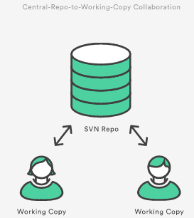
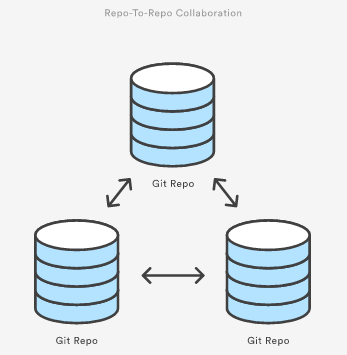

## git clone

Here we'll examine the `git clone` command in depth. `git clone` is a Git command line utility which is used to target an existing repository and create a clone, or copy of the target repository. In this page we'll discuss extended configuration options and common use cases of git clone. Some points we'll cover here are:  
- Cloning a local or remote repository  
- Cloning a bare repository  
- Using shallow options to partially clone repositories  
- Git URL syntax and supported protocols  

On the [setting up a repository guide](https://www.atlassian.com/git/tutorials/setting-up-a-repository), we covered a basic use case of `git clone`. This page will explore more complex cloning and configuration scenarios.

###Purpose: repo-to-repo collaboration development copy

If a project has already been set up in a central repository, the git clone command is the most common way for users to obtain a development copy. Like `git init`, cloning is generally a one-time operation. Once a developer has obtained a working copy, all version control operations and collaborations are managed through their local repository.

#### Repo-to-repo collaboration

It’s important to understand that Git’s idea of a “working copy” is very different from the working copy you get by checking out code from an SVN repository. Unlike SVN, Git makes no distinction between the working copy and the central repository—they're all full-fledged [Git repositories](http://bitbucket.org/code-repository).

This makes collaborating with Git fundamentally different than with SVN. Whereas SVN depends on the relationship between the central repository and the working copy, Git’s collaboration model is based on repository-to-repository interaction. Instead of checking a working copy into SVN’s central repository, you [push](https://www.atlassian.com/git/tutorials/syncing/git-push) or [pull](https://www.atlassian.com/git/tutorials/syncing/git-pull) commits from one repository to another.





Of course, there’s nothing stopping you from giving certain Git repos special meaning. For example, by simply designating one Git repo as the “central” repository, it’s possible to replicate a [centralized workflow](https://www.atlassian.com/git/tutorials/comparing-workflows) using Git. The point is, this is accomplished through conventions rather than being hardwired into the VCS itself.

### Usage

`git clone` is primarily used to point to an existing repo and make a clone or copy of that repo at in a new directory, at another location. The original repository can be located on the local filesystem or on remote machine accessible supported protocols. The git clone command copies an existing Git repository. This is sort of like SVN checkout, except the “working copy” is a full-fledged Git repository—it has its own history, manages its own files, and is a completely isolated environment from the original repository.

As a convenience, cloning automatically creates a remote connection called "origin" pointing back to the original repository. This makes it very easy to interact with a central repository. This automatic connection is established by creating Git refs to the remote branch heads under `refs/remotes/origin` and by initializing `remote.origin.url` and `remote.origin.fetch` configuration variables.

An example demonstrating using git clone can be found on the [setting up a repository guide](https://www.atlassian.com/git/tutorials/setting-up-a-repository). The example below demonstrates how to obtain a local copy of a central repository stored on a server accessible at `example.com` using the SSH username john:

```
git clone ssh://john@example.com/path/to/my-project.git
cd my-project
# Start working on the project
```

The first command initializes a new Git repository in the `my-project` folder on your local machine and populates it with the contents of the central repository. Then, you can cd into the project and start editing files, committing snapshots, and interacting with other repositories. Also note that the `.git` extension is omitted from the cloned repository. This reflects the non-bare status of the local copy.

#### Cloning to a specific folder

```
git clone <repo> <directory>
```

Clone the repository located at `<repo>` into the folder called `~<directory>`! on the local machine.

#### Cloning a specific tag

```
git clone --branch <tag> <repo>
```

Clone the repository located at `<repo>` and only clone the ref for `<tag>`.

#### Shallow clone

```
git clone -depth=1 <repo>
```

Clone the repository located at `<repo>` and only clone the 
history of commits specified by the option `depth=1`. In this example a clone of `<repo>` is made and only the most recent commit is included in the new cloned Repo. Shallow cloning is most useful when working with repos that have an extensive commit history. An extensive commit history may cause scaling problems such as disk space usage limits and long wait times when cloning. A Shallow clone can help alleviate these scaling issues.

### Configuration options

```
git clone -branch
```

The `-branch` argument lets you specify a specific branch to clone instead of the branch the remote `HEAD` is pointing to, usually the master branch. In addition you can pass a tag instead of branch for the same effect.

```
git clone -branch new_feature git://remoterepository.git
```

This above example would clone only the `new_feature` branch from the remote Git repository. This is purely a convince utility to save you time from downloading the `HEAD` ref of the repository and then having to additionally fetch the ref you need.

#### git clone -mirror vs. git clone -bare

**git clone --bare**  
Similar to `git init --bare`, when the `-bare` argument is passed to `git clone`, a copy of the remote repository will be made with an omitted working directory. This means that a repository will be set up with the history of the project that can be pushed and pulled from, but cannot be edited directly. In addition, no remote branches for the repo will be configured with the `-bare` repository. Like `git init --bare`, this is used to create a hosted repository that developers will not edit directly.

**git clone --mirror** 
Passing the `--mirror` argument implicitly passes the `--bare` argument as well. This means the behavior of `--bare` is inherited by `--mirror`. Resulting in a bare repo with no editable working files. In addition, `--mirror` will clone all the extended refs of the remote repository, and maintain remote branch tracking configuration. You can then run git remote update on the mirror and it will overwrite all refs from the origin repo. Giving you exact 'mirrored' functionality.

#### Other configuration options

For a comprehensive list of other git clone options visit the [official Git documentation](https://git-scm.com/docs/git-clone). In this document, we'll touch on some other common options.

**git clone --template** 
```
git clone --template=<template_directory> <repo location>
```

Clones the repo at `<repo location>` and applies the template from `<template directory>` to the newly created local branch. A thorough refrence on Git templates can be found on our [git init page](http://www.atlassian.com/git/tutorials/setting-up-a-repository/git-init).
 

Git URLs
Git has its own URL syntax which is used to pass remote repository locations to Git commands. Because git clone is most commonly used on remote repositories we will examine Git URL syntax here.
 
### Git URL protocols

**SSH**  
Secure Shell (SSH) is a ubiquitous authenticated network protocol that is commonly configured by default on most servers. Because SSH is an authenticated protocol, you'll need to establish credentials with the hosting server before connecting. `ssh://[user@]host.xz[:port]/path/to/repo.git/`
 
**GIT**  
A protocol unique to git. Git comes with a daemon that runs on port (9418). The protocol is similar to SSH however it has NO AUTHENTICATION. `git://host.xz[:port]/path/to/repo.git/`
 
**HTTP**  
Hyper text transfer protocol. The protocol of the web, most commonly used for transferring web page HTML data over the Internet. Git can be configured to communicate over HTTP `http[s]://host.xz[:port]/path/to/repo.git/`
 
### Summary

In this document we took a deep look at git clone. The most important takeaways are:
1. `git clone` is used to create a copy of a target repo
2. The target repo can be local or remote
3. Git supports a few network protocols to connect to remote repos
4. There are many different configuration options available that change the content of the clone
 

For further, deeper reference on git clone functionality, consult the [official Git documentation](https://git-scm.com/docs/git-clone). We also cover practical examples of git clone in our [setting up a repository guide](https://www.atlassian.com/git/tutorials/setting-up-a-repository).
