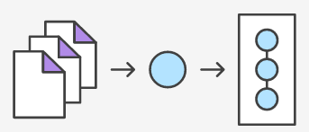

### git add

The git add command adds a change in the working directory to the staging area. It tells Git that you want to include updates to a particular file in the next commit. However, `git add` doesn't really affect the repository in any significant way—changes are not actually recorded until you run [git commit](#git-commit).

In conjunction with these commands, you'll also need [git status](#inspecting-a-repository) to view the state of the working directory and the staging area.

#### How it works

The `git add` and [git commit](#saving-changes) commands compose the fundamental Git workflow. These are the two commands that every Git user needs to understand, regardless of their team’s collaboration model. They are the means to record versions of a project into the repository’s history.

Developing a project revolves around the basic edit/stage/commit pattern. First, you edit your files in the working directory. When you’re ready to save a copy of the current state of the project, you stage changes with git add. After you’re happy with the staged snapshot, you commit it to the project history with `git commit`. The [git reset](#git-reset) command is used to undo a commit or staged snapshot.

In addition to `git add` and `git commit`, a third command [git push](#syncing) is essential for a complete collaborative Git workflow. `git push` is utilized to send the committed changes to remote repositories for collaboration. This enables other team members to access a set of saved changes.



The `git add` command should not be confused with svn add, which adds a file to the repository. Instead, `git add` works on the more abstract level of changes. This means that `git add` needs to be called every time you alter a file, whereas `svn add` only needs to be called once for each file. It may sound redundant, but this workflow makes it much easier to keep a project organized.

#### The staging area

The primary function of the `git add` command, is to promote pending changes in the working directory, to the `git staging` area. The staging area is one of Git's more unique features, and it can take some time to wrap your head around it if you’re coming from an SVN (or even a Mercurial) background. It helps to think of it as a buffer between the working directory and the project history. The staging area is considered one of [the "three trees"](#git-reset) of Git, along with, the working directory, and the commit history.

Instead of committing all of the changes you've made since the last commit, the stage lets you group related changes into highly focused snapshots before actually committing it to the project history. This means you can make all sorts of edits to unrelated files, then go back and split them up into logical commits by adding related changes to the stage and commit them piece-by-piece. As in any revision control system, it’s important to create atomic commits so that it’s easy to track down bugs and revert changes with minimal impact on the rest of the project.

#### Common options

```
git add <file>
```

Stage all changes in `<file>` for the next commit.

```
git add <directory>
```

Stage all changes in `<directory>` for the next commit.

```
git add -p
```

Begin an interactive staging session that lets you choose portions of a file to add to the next commit. This will present you with a chunk of changes and prompt you for `a` command. Use `y` to stage the chunk, `n` to ignore the chunk, `s` to split it into smaller chunks, `e` to manually edit the chunk, and `q` to exit.

#### Examples

When you’re starting a new project, git add serves the same function as svn import. To create an initial commit of the current directory, use the following two commands:

```
git add .
git commit
```

Once you’ve got your project up-and-running, new files can be added by passing the path to `git add`:

```
git add hello.py
git commit
```

The above commands can also be used to record changes to existing files. Again, Git doesn’t differentiate between staging changes in new files vs. changes in files that have already been added to the repository.

#### Summary

In review, git add is the first command in a chain of operations that directs Git to "save" a snapshot of the current project state, into the commit history. When used on its own, `git add` will promote pending changes from the working directory to the staging area. The [git status](#inspecting-a-repository) command is used to examine the current state of the repository and can be used to confirm a `git add` promotion. The [git reset](#git-reset) command is used to undo a `git add`. The [git commit](#git-commit) command is then used to Commit a snapshot of the staging directory to the repositories commit history.
