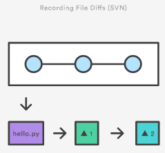
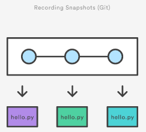

### git commit

The `git commit` command captures a snapshot of the project's currently staged changes. Committed snapshots can be thought of as “safe” versions of a project—Git will never change them unless you explicitly ask it to. Prior to the execution of `git commit`, The [git add](#saving-changes) command is used to promote or 'stage' changes to the project that will be stored in a commit. These two commands `git commit` and `git add` are two of the most frequently used.

#### Git commit vs SVN commit

While they share the same name, `git commit` is nothing like `svn commit`. This shared term can be a point of confusion for Git newcomers who have a svn background, and it is important to emphasize the difference. To compare `git commit` vs `svn commit` is to compare a centralized application model (svn) vs a distributed application model (Git). In SVN, a commit pushes changes from the local SVN client, to a remote centralized shared SVN repository. In Git, repositories are distributed, Snapshots are committed to the local repository, and this requires absolutely no interaction with other Git repositories. Git commits can later be pushed to arbitrary remote repositories.

#### How it works

At a high-level, Git can be thought of as a timeline management utility. Commits are the core building block units of a Git project timeline. Commits can be thought of as snapshots or milestones along the timeline of a Git project. Commits are created with the `git commit` command to capture the state of a project at that point in time. Git Snapshots are always committed to the local repository. This is fundamentally different from SVN, wherein the working copy is committed to the central repository. In contrast, Git doesn’t force you to interact with the central repository until you’re ready. Just as the staging area is a buffer between the working directory and the project history, each developer’s local repository is a buffer between their contributions and the central repository.

This changes the basic development model for Git users. Instead of making a change and committing it directly to the central repo, Git developers have the opportunity to accumulate commits in their local repo. This has many advantages over SVN-style collaboration: it makes it easier to split up a feature into atomic commits, keep related commits grouped together, and clean up local history before publishing it to the central repository. It also lets developers work in an isolated environment, deferring integration until they’re at a convenient point to merge with other users. While isolation and deferred integration are individually beneficial, it is in a team's best interest to integrate frequently and in small units. For more information regarding best practices for Git team collaboration read how teams structure their [Git workflow](#comparing-workflows).

#### Snapshots, not differences

Aside from the practical distinctions between SVN and Git, their underlying implementation also follows entirely divergent design philosophies. Whereas SVN tracks differences of a file, Git’s version control model is based on snapshots. For example, a SVN commit consists of a diff compared to the original file added to the repository. Git, on the other hand, records the entire contents of each file in every commit.





This makes many Git operations much faster than SVN, since a particular version of a file doesn’t have to be “assembled” from its diffs—the complete revision of each file is immediately available from Git's internal database.

Git's snapshot model has a far-reaching impact on virtually every aspect of its version control model, affecting everything from its branching and merging tools to its collaboration work-flows.

#### Common options

```
git commit
```

Commit the staged snapshot. This will launch a text editor prompting you for a commit message. After you’ve entered a message, save the file and close the editor to create the actual commit.

```
git commit -a
```

Commit a snapshot of all changes in the working directory. This only includes modifications to tracked files (those that have been added with git add at some point in their history).

```
git commit -m "commit message"
```

A shortcut command that immediately creates a commit with a passed commit message. By default, `git commit` will open up the locally configured text editor, and prompt for a commit message to be entered. Passing the `-m` option will forgo the text editor prompt in-favor of an inline message.

```
git commit -am "commit message"
```

A power user shortcut command that combines the `-a` and `-m` options. This combination immediately creates a commit of all the staged changes and takes an inline commit message.

```
git commit --amend
```

This option adds another level of functionality to the commit command. Passing this option will modify the last commit. Instead of creating a new commit, staged changes will be added to the previous commit. This command will open up the system's configured text editor and prompt to change the previously specified commit message.

#### Examples

##### Saving changes with a commit

The following example assumes you’ve edited some content in a file called `hello.py` on the current branch, and are ready to commit it to the project history. First, you need to stage the file with `git add`, then you can commit the staged snapshot.

```
git add hello.py
```

This command will add `hello.py` to the Git staging area. We can examine the result of this action by using the git status command.

```
git status
On branch master
Changes to be committed:
  (use "git reset HEAD <file>..." to unstage)
  new file: hello.py
```

The green output new file: `hello.py` indicates that `hello.py `will be saved with the next commit. From the commit is created by executing:

```
git commit
```

This will open a text editor (customizable via `git config`) asking for a commit log message, along with a list of what’s being committed:

```
# Please enter the commit message for your changes. Lines starting
# with '#' will be ignored, and an empty message aborts the commit.
# On branch master
# Changes to be committed:
# (use "git reset HEAD ..." to unstage)
#
#modified: hello.py
```

Git doesn't require commit messages to follow any specific formatting constraints, but the canonical format is to summarize the entire commit on the first line in less than 50 characters, leave a blank line, then a detailed explanation of what’s been changed. For example:

```
Change the message displayed by hello.py

- Update the sayHello() function to output the user's name
- Change the sayGoodbye() function to a friendlier message
```

It is a common practice to use the first line of the commit message as a subject line, similar to an email. The rest of the log message is considered the body and used to communicate details of the commit change set. Note that many developers also like to use the present tense in their commit messages. This makes them read more like actions on the repository, which makes many of the history-rewriting operations more intuitive.
 
#### How to update (amend) a commit

To continue with the `hello.py` example above. Let's make further updates to `hello.py` and execute the following:

```
git add hello.py
git commit --amend
```

This will once again, open up the configured text editor. This time, however, it will be pre-filled with the commit message we previously entered. This indicates that we are not creating a new commit, but editing the last.

#### Summary

The `git commit` command is one of the core primary functions of Git. Prior use of the git add command is required to select the changes that will be staged for the next commit. Then `git commit` is used to create a snapshot of the staged changes along a timeline of a Git projects history. Learn more about [git add](#saving-changes) usage on the accompanying page. The [git status](#inspecting-a-repository) command can be used to explore the state of the staging area and pending commit.

The commit model of SVN and Git are significantly different but often confused, because of the shared terminology. If you are coming to Git from a personal history of SVN usage, it is good to learn that in Git, commits are cheap and should be used frequently. Whereas SVN commits are an expensive operation that makes a remote request, Git commits are done locally and with a more efficient algorithm.
