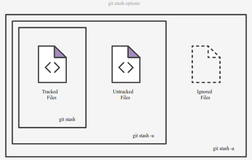
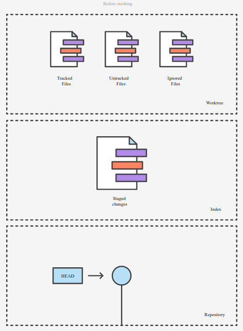
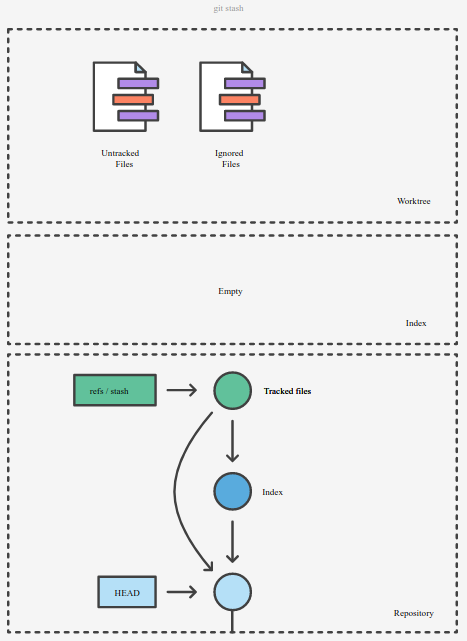
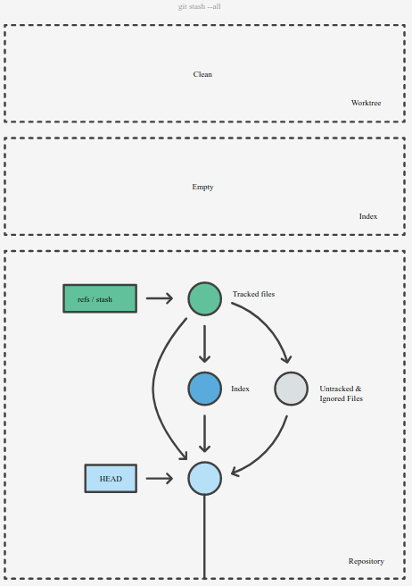

## git stash

`git stash` temporarily shelves (or *stashes*) changes you've made to your working copy so you can work on something else, and then come back and re-apply them later on. Stashing is handy if you need to quickly switch context and work on something else, but you're mid-way through a code change and aren't quite ready to commit.
- Git Stash  
    - [Stashing your work](https://www.atlassian.com/git/tutorials/saving-changes/git-stash#stashing-your-work)  
    - [Re-applying your stashed changes](https://www.atlassian.com/git/tutorials/saving-changes/git-stash#re-applying-your-stashed-changes)  
    - [Stashing untracked or ignored files](https://www.atlassian.com/git/tutorials/saving-changes/git-stash#stashing-untracked-or-ignored)  
    - [Managing multiple stashes](https://www.atlassian.com/git/tutorials/saving-changes/git-stash#managing-multiple-stashes)  
    - [Viewing stash diffs](https://www.atlassian.com/git/tutorials/saving-changes/git-stash#viewing-stash-diffs)  
    - [Partial stashes](https://www.atlassian.com/git/tutorials/saving-changes/git-stash#partial-stashes)  
    - [Creating a branch from your stash](https://www.atlassian.com/git/tutorials/saving-changes/git-stash#creating-a-branch-from-your-stash)  
    - [Cleaning up your stash](https://www.atlassian.com/git/tutorials/saving-changes/git-stash#cleaning-up-your-stash)  
    - [How git stash works](https://www.atlassian.com/git/tutorials/saving-changes/git-stash#how-git-stash-works)  

### Stashing your work

The `git stash` command takes your uncommitted changes (both staged and unstaged), saves them away for later use, and then reverts them from your working copy. For example:

```
$ git status
On branch master
Changes to be committed:

 new file: style.css

Changes not staged for commit:

 modified: index.html

$ git stash
Saved working directory and index state WIP on master: 5002d47 our new homepage
HEAD is now at 5002d47 our new homepage

$ git status
On branch master
nothing to commit, working tree clean
```

At this point you're free to make changes, create new commits, switch branches, and perform any other Git operations; then come back and re-apply your stash when you're ready.

Note that the stash is local to your Git repository; stashes are not transferred to the server when you push.

### Re-applying your stashed changes

You can reapply previously stashed changes with `git stash pop`:

```
$ git status
On branch master
nothing to commit, working tree clean
$ git stash pop
On branch master
Changes to be committed:

 new file: style.css

Changes not staged for commit:

 modified: index.html

Dropped refs/stash@{0} (32b3aa1d185dfe6d57b3c3cc3b32cbf3e380cc6a)
```

*Popping* your stash removes the changes from your stash and reapplies them to your working copy.

Alternatively, you can reapply the changes to your working copy *and* keep them in your stash with `git stash apply`:

```
$ git stash apply
On branch master
Changes to be committed:

 new file: style.css

Changes not staged for commit:

 modified: index.html
```

This is useful if you want to apply the same stashed changes to multiple branches.

Now that you know the basics of stashing, there is one caveat with `git stash` you need to be aware of: by default Git *won't* stash changes made to untracked or ignored files.

### Stashing untracked or ignored files

By default, running `git stash` will stash:    
- changes that have been added to your index (staged changes)  
- changes made to files that are currently tracked by Git (unstaged changes)  

But it will **not** stash:  
- new files in your working copy that have not yet been staged  
- files that have been ignored  

So if we add a third file to our example above, but don't stage it (i.e. we don't run `git add`), `git stash` won't stash it.

```
$ script.js

$ git status
On branch master
Changes to be committed:

 new file: style.css

Changes not staged for commit:

 modified: index.html

Untracked files:

 script.js

$ git stash
Saved working directory and index state WIP on master: 5002d47 our new homepage
HEAD is now at 5002d47 our new homepage

$ git status
On branch master
Untracked files:

 script.js
```

Adding the `-u` option (or `--include-untracked`) tells `git stash` to also stash your untracked files:

```
$ git status
On branch master
Changes to be committed:

 new file: style.css

Changes not staged for commit:

 modified: index.html

Untracked files:

 script.js

$ git stash -u
Saved working directory and index state WIP on master: 5002d47 our new homepage
HEAD is now at 5002d47 our new homepage

$ git status
On branch master
nothing to commit, working tree clean
```

You can include changes to [ignored](https://www.atlassian.com/git/tutorials/gitignore) files as well by passing the `-a` option (or `--all`) when running `git stash`.



### Managing multiple stashes

You aren't limited to a single stash. You can run git stash several times to create multiple stashes, and then use `git stash list` to view them. By default, stashes are identified simply as a "WIP" – work in progress – on top of the branch and commit that you created the stash from. After a while it can be difficult to remember what each stash contains:

```
$ git stash list
stash@{0}: WIP on master: 5002d47 our new homepage
stash@{1}: WIP on master: 5002d47 our new homepage
stash@{2}: WIP on master: 5002d47 our new homepage
```

To provide a bit more context, it's good practice to annotate your stashes with a description, using `git stash save "message"`:

```
$ git stash save "add style to our site"
Saved working directory and index state On master: add style to our site
HEAD is now at 5002d47 our new homepage

$ git stash list
stash@{0}: On master: add style to our site
stash@{1}: WIP on master: 5002d47 our new homepage
stash@{2}: WIP on master: 5002d47 our new homepage
```

By default, `git stash pop` will re-apply the most recently created stash: `stash@{0}`

You can choose which stash to re-apply by passing its identifier as the last argument, for example:

```
$ git stash pop stash@{2}
```

### Viewing stash diffs

You can view a summary of a stash with `git stash show`:

```
$ git stash show
 index.html | 1 +
 style.css | 3 +++
 2 files changed, 4 insertions(+)
```

Or pass the `-p` option (or `--patch`) to view the full diff of a stash:

```
$ git stash show -p
diff --git a/style.css b/style.css
new file mode 100644
index 0000000..d92368b
--- /dev/null
+++ b/style.css
@@ -0,0 +1,3 @@
+* {
+ text-decoration: blink;
+}
diff --git a/index.html b/index.html
index 9daeafb..ebdcbd2 100644
--- a/index.html
+++ b/index.html
@@ -1 +1,2 @@
+<link rel="stylesheet" href="style.css"/>
```

### Partial stashes

You can also choose to stash just a single file, a collection of files, or individual changes from within files. If you pass the `-p` option (or `--patch`) to git stash, it will iterate through each changed "hunk" in your working copy and ask whether you wish to stash it:

```
$ git stash -p
diff --git a/style.css b/style.css
new file mode 100644
index 0000000..d92368b
--- /dev/null
+++ b/style.css
@@ -0,0 +1,3 @@
+* {
+ text-decoration: blink;
+}
Stash this hunk [y,n,q,a,d,/,e,?]? y
diff --git a/index.html b/index.html
index 9daeafb..ebdcbd2 100644
--- a/index.html
+++ b/index.html
@@ -1 +1,2 @@
+<link rel="stylesheet" href="style.css"/>
Stash this hunk [y,n,q,a,d,/,e,?]? n
```


You can hit **?** for a full list of hunk commands. Commonly useful ones are:

| **Command** | **Description**                                                  |
| ----------- | ---------------------------------------------------------------- |
| */*         |	search for a hunk by regex                                       |
| *?*         |	help                                                             |
| *n*         |	don't stash this hunk                                            |
| *q*         |	quit (any hunks that have already been selected will be stashed) |
| *s*         |	split this hunk into smaller hunks                               |
| *y*         |	stash this hunk                                                  |

There is no explicit "abort" command, but hitting `CTRL-C (SIGINT)` will abort the stash process.

### Creating a branch from your stash

If the changes on your branch diverge from the changes in your stash, you may run into conflicts when popping or applying your stash. Instead, you can use git stash branch to create a new branch to apply your stashed changes to:

```
$ git stash branch add-stylesheet stash@{1}
Switched to a new branch 'add-stylesheet'
On branch add-stylesheet
Changes to be committed:

 new file: style.css

Changes not staged for commit:

 modified: index.html

Dropped refs/stash@{1} (32b3aa1d185dfe6d57b3c3cc3b32cbf3e380cc6a)
```

This checks out a new branch based on the commit that you created your stash from, and then pops your stashed changes onto it.

### Cleaning up your stash

If you decide you no longer need a particular stash, you can delete it with `git stash drop`:

```
$ git stash drop stash@{1}
Dropped stash@{1} (17e2697fd8251df6163117cb3d58c1f62a5e7cdb)
```

Or you can delete all of your stashes with:

```
$ git stash clear
```

### How git stash works

If you just wanted to know how to use `git stash`, you can stop reading here. But if you're curious about how Git (and `git stash`) works under the hood, read on!

Stashes are actually encoded in your repository as commit objects. The special ref at `.git/refs/stash` points to your most recently created stash, and previously created stashes are referenced by the stash ref's reflog. This is why you refer to stashes by `stash@{n}`: you're actually referring to the nth reflog entry for the stash ref. Since a stash is just a commit, you can inspect it with `git log`:

```
$ git log --oneline --graph stash@{0}
*-. 953ddde WIP on master: 5002d47 our new homepage
|\ \ 
| | * 24b35a1 untracked files on master: 5002d47 our new homepage
| * 7023dd4 index on master: 5002d47 our new homepage
|/ 
* 5002d47 our new homepage
```

Depending on what you stashed, a single `git stash` operation creates either two or three new commits. The commits in the diagram above are:    
- *stash@{0}*, a new commit to store the tracked files that were in your working copy when you ran `git stash`  
- *stash@{0}*'s first parent, the pre-existing commit that was at HEAD when you ran `git stash`  
- *stash@{0}*'s second parent, a new commit representing the index when you ran `git stash`  
- *stash@{0}*'s third parent, a new commit representing untracked files that were in your working copy when you ran `git stash`. This third parent only created if:  
    - your working copy actually contained untracked files; and  
    - you specified the `--include-untracked` or `--all` option when invoked git stash.  

How `git stash` encodes your worktree and index as commits:  
- Before stashing, your worktree may contain changes to tracked files, untracked files, and ignored files. Some of these changes may also be staged in the index.



- Invoking `git stash` encodes any changes to tracked files as two new commits in your DAG: one for unstaged changes, and one for changes staged in the index. The special `refs/stash ref` is updated to point to them.



- Using the `--include-untracked` option also encodes any changes to untracked files as an additional commit.


- Using the `--all` option includes changes to any ignored files alongside changes to untracked files in the same commit.



When you run `git stash pop`, the changes from the commits above are used to update your working copy and index, and the stash reflog is shuffled to remove the popped commit. Note that the popped commits aren't immediately deleted, but do become candidates for future garbage collection.
