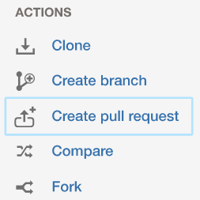
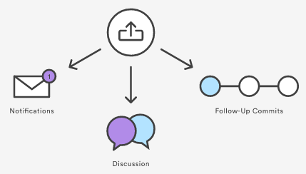
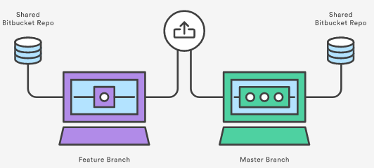
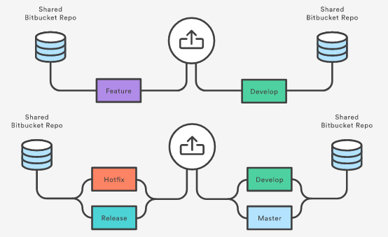
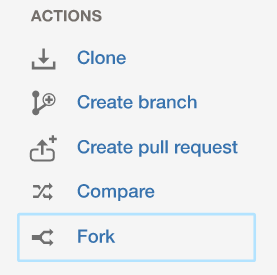
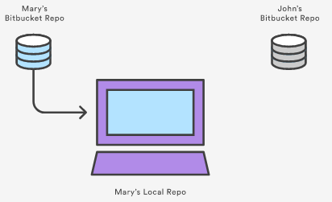
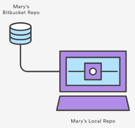
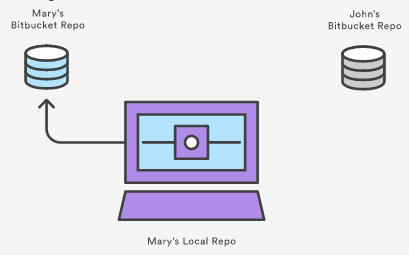
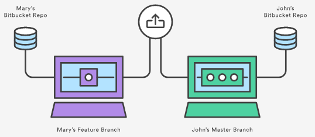
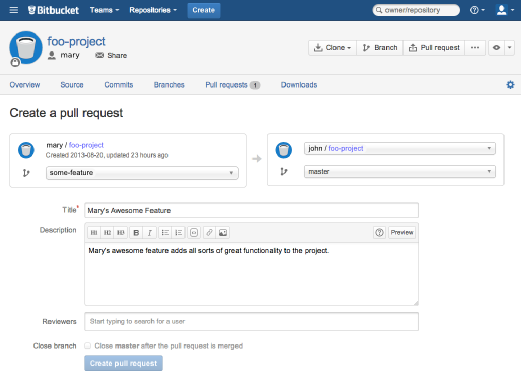

## Making a Pull Request

Pull requests are a feature that makes it easier for developers to collaborate using [Bitbucket](http://www.bitbucket.org/). They provide a user-friendly web interface for discussing proposed changes before integrating them into the official project.



In their simplest form, pull requests are a mechanism for a developer to notify team members that they have completed a feature. Once their feature branch is ready, the developer files a pull request via their Bitbucket account. This lets everybody involved know that they need to review the code and merge it into the master branch.

But, the pull request is more than just a notification—it’s a dedicated forum for discussing the proposed feature. If there are any problems with the changes, teammates can post feedback in the pull request and even tweak the feature by pushing follow-up commits. All of this activity is tracked directly inside of the pull request.



Compared to other collaboration models, this formal solution for sharing commits makes for a much more streamlined workflow. SVN and Git can both automatically send notification emails with a simple script; however, when it comes to discussing changes, developers typically have to rely on email threads. This can become haphazard, especially when follow-up commits are involved. Pull requests put all of this functionality into a friendly web interface right next to your Bitbucket repositories.

### Anatomy of a Pull Request

When you file a pull request, all you’re doing is *requesting* that another developer (e.g., the project maintainer) *pulls* a branch from your repository into their repository. This means that you need to provide 4 pieces of information to file a pull request: the source repository, the source branch, the destination repository, and the destination branch.


Many of these values will be set to a sensible default by Bitbucket. However, depending on your collaboration workflow, your team may need to specify different values. The above diagram shows a pull request that asks to merge a feature branch into the official master branch, but there are many other ways to use pull requests.

### How it works

Pull requests can be used in conjunction with the [Feature Branch Workflow](https://www.atlassian.com/git/tutorials/comparing-workflows/feature-branch-workflow), the [Gitflow Workflow](https://www.atlassian.com/git/tutorials/comparing-workflows/gitflow-workflow), or the [Forking Workflow](https://www.atlassian.com/git/tutorials/comparing-workflows/forking-workflow). But a pull request requires either two distinct branches or two distinct repositories, so they will not work with the [Centralized Workflow](https://www.atlassian.com/git/tutorials/comparing-workflows/centralized-workflow). Using pull requests with each of these workflows is slightly different, but the general process is as follows:  
1. A developer creates the feature in a dedicated branch in their local repo.
2. The developer pushes the branch to a public Bitbucket repository.
3. The developer files a pull request via Bitbucket.
4. The rest of the team reviews the code, discusses it, and alters it.
5. The project maintainer merges the feature into the official repository and closes the pull request.
6. The rest of this section describes how pull requests can be leveraged against different collaboration workflows.

#### Feature Branch Workflow With Pull Requests

The Feature Branch Workflow uses a shared Bitbucket repository for managing collaboration, and developers create features in isolated branches. But, instead of immediately merging them into master, developers should open a pull request to initiate a discussion around the feature before it gets integrated into the main codebase.



There is only one public repository in the Feature Branch Workflow, so the pull request’s destination repository and the source repository will always be the same. Typically, the developer will specify their feature branch as the source branch and the master branch as the destination branch.

After receiving the pull request, the project maintainer has to decide what to do. If the feature is ready to go, they can simply merge it into master and close the pull request. But, if there are problems with the proposed changes, they can post feedback in the pull request. Follow-up commits will show up right next to the relevant comments.

It’s also possible to file a pull request for a feature that is incomplete. For example, if a developer is having trouble implementing a particular requirement, they can file a pull request containing their work-in-progress. Other developers can then provide suggestions inside of the pull request, or even fix the problem themselves with additional commits.

#### Gitflow Workflow With Pull Requests

The Gitflow Workflow is similar to the Feature Branch Workflow, but defines a strict branching model designed around the project release. Adding pull requests to the Gitflow Workflow gives developers a convenient place to talk about a release branch or a maintenance branch while they’re working on it.



The mechanics of pull requests in the Gitflow Workflow are the exact same as the previous section: a developer simply files a pull request when a feature, release, or hotfix branch needs to be reviewed, and the rest of the team will be notified via Bitbucket.

Features are generally merged into the develop branch, while release and hotfix branches are merged into both develop and master. Pull requests can be used to formally manage all of these merges.

#### Forking Workflow With Pull Requests

In the Forking Workflow, a developer pushes a completed feature to *their own* public repository instead of a shared one. After that, they file a pull request to let the project maintainer know that it’s ready for review.

The notification aspect of pull requests is particularly useful in this workflow because the project maintainer has no way of knowing when another developer has added commits to their Bitbucket repository.


Since each developer has their own public repository, the pull request’s source repository will differ from its destination repository. The source repository is the developer’s public repository and the source branch is the one that contains the proposed changes. If the developer is trying to merge the feature into the main codebase, then the destination repository is the official project and the destination branch is `master`.

Pull requests can also be used to collaborate with other developers outside of the official project. For example, if a developer was working on a feature with a teammate, they could file a pull request using the *teammate’s* Bitbucket repository for the destination instead of the official project. They would then use the same feature branch for the source and destination branches.


The two developers could discuss and develop the feature inside of the pull request. When they’re done, one of them would file another pull request asking to merge the feature into the official master branch. This kind of flexibility makes pull requests very powerful collaboration tool in the Forking workflow.

### Example

The example below demonstrates how pull requests can be used in the Forking Workflow. It is equally applicable to developers working in small teams and to a third-party developer contributing to an open source project.

In the example, Mary is a developer, and John is the project maintainer. Both of them have their own public Bitbucket repositories, and John’s contains the official project.

#### Mary forks the official project


To start working in the project, Mary first needs to fork John’s Bitbucket repository. She can do this by signing in to Bitbucket, navigating to John’s repository, and clicking the *Fork* button.



After filling out the name and description for the forked repository, she will have a server-side copy of the project.

#### Mary clones her Bitbucket repository



Next, Mary needs to clone the Bitbucket repository that she just forked. This will give her a working copy of the project on her local machine. She can do this by running the following command:

```
git clone https://user@bitbucket.org/user/repo.git
```

Keep in mind that git clone automatically creates an origin remote that points back to Mary’s forked repository.

#### Mary develops a new feature



Before she starts writing any code, Mary needs to create a new branch for the feature. This branch is what she will use as the source branch of the pull request.

```
git checkout -b some-feature
# Edit some code
git commit -a -m "Add first draft of some feature"
```

Mary can use as many commits as she needs to create the feature. And, if the feature’s history is messier than she would like, she can use an [interactive rebase](https://www.atlassian.com/git/tutorials/rewriting-history/git-rebase-i) to remove or squash unnecessary commits. For larger projects, cleaning up a feature’s history makes it much easier for the project maintainer to see what’s going on in the pull request.

#### Mary pushes the feature to her Bitbucket repository



After her feature is complete, Mary pushes the feature branch to her own Bitbucket repository (not the official repository) with a simple git push:

```
git push origin some-branch
```

This makes her changes available to the project maintainer (or any collaborators who might need access to them).

#### Mary creates the pull request



After Bitbucket has her feature branch, Mary can create the pull request through her Bitbucket account by navigating to her forked repository and clicking the *Pull request* button in the top-right corner. The resulting form automatically sets Mary’s repository as the source repository, and it asks her to specify the source branch, the destination repository, and the destination branch.

Mary wants to merge her feature into the main codebase, so the source branch is her feature branch, the destination repository is John’s public repository, and the destination branch is `master`. She’ll also need to provide a title and description for the pull request. If there are other people who need to approve the code besides John, she can enter them in the *Reviewers* field.



After she creates the pull request, a notification will be sent to John via his Bitbucket feed and (optionally) via email.

#### John reviews the pull request


John can access all of the pull requests people have filed by clicking on the *Pull request* tab in his own Bitbucket repository. Clicking on Mary’s pull request will show him a description of the pull request, the feature’s commit history, and a diff of all the changes it contains.

If he thinks the feature is ready to merge into the project, all he has to do is hit the *Merge* button to approve the pull request and merge Mary’s feature into his `master` branch.

But, for this example, let’s say John found a small bug in Mary’s code, and needs her to fix it before merging it in. He can either post a comment to the pull request as a whole, or he can select a specific commit in the feature’s history to comment on.


#### Mary adds a follow-up commit

If Mary has any questions about the feedback, she can respond inside of the pull request, treating it as a discussion forum for her feature.

To correct the error, Mary adds another commit to her feature branch and pushes it to her Bitbucket repository, just like she did the first time around. This commit is automatically added to the original pull request, and John can review the changes again, right next to his original comment.

#### John accepts the pull request

Finally, John accepts the changes, merges the feature branch into master, and closes the pull request. The feature is now integrated into the project, and any other developers working on it can pull it into their own local repositories using the standard git pull command.

### Where to go from here

You should now have all of the tools you need to start integrating pull requests into your existing workflow. Remember, pull requests are not a replacement for any of the [Git-based collaboration workflows](https://www.atlassian.com/git/tutorials/comparing-workflows), but rather a convenient addition to them that makes collaboration more accessible to all of your team members.
