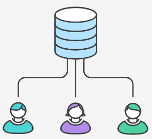
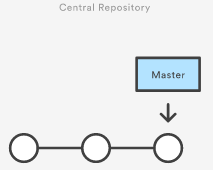
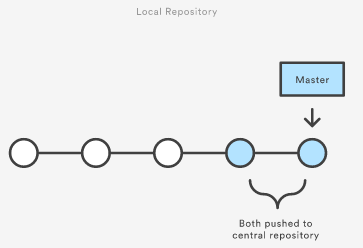
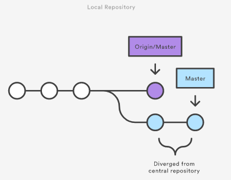
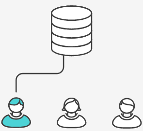
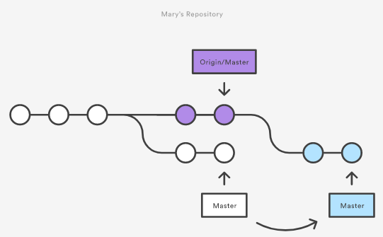
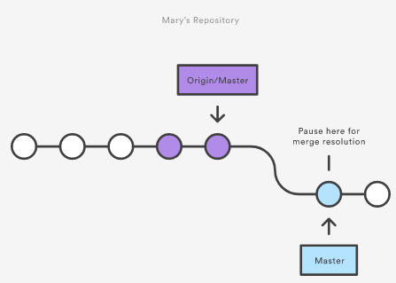
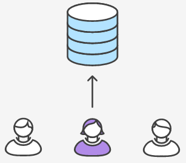

### Centralized workflow

A Git Workflow is a recipe or recommendation for how to use Git to accomplish work in a consistent and productive manner. Git workflows encourage users to leverage Git effectively and consistently. Git offers a lot of flexibility in how users manage changes. Given Git's focus on flexibility, there is no standardized process on how to interact with Git. When working with a team on a Git managed project, it’s important to make sure the team is all in agreement on how the flow of changes will be applied. To ensure the team is on the same page, an agreed upon Git workflow should be developed or selected. There are several publicized Git workflows that may be a good fit for your team. Here, we’ll be discussing some of these workflow options.

The array of possible workflows can make it hard to know where to begin when implementing Git in the workplace. This page provides a starting point by surveying the most common Git workflows for software teams.

As you read through, remember that these workflows are designed to be guidelines rather than concrete rules. We want to show you what’s possible, so you can mix and match aspects from different workflows to suit your individual needs.

#### What is a successful Git workflow?

When evaluating a workflow for your team, it's most important that you consider your team’s culture. You want the workflow to enhance the effectiveness of your team and not be a burden that limits productivity. Some things to consider when evaluating a Git workflow are:  
- Does this workflow scale with team size?
- Is it easy to undo mistakes and errors with this workflow?
- Does this workflow impose any new unnecessary cognitive overhead to the team?

#### Centralized Workflow



The Centralized Workflow is a great Git workflow for teams transitioning from SVN. Like Subversion, the Centralized Workflow uses a central repository to serve as the single point-of-entry for all changes to the project. Instead of `trunk`, the default development branch is called `master` and all changes are committed into this branch. This workflow doesn’t require any other branches besides `master`.

Transitioning to a distributed version control system may seem like a daunting task, but you don’t have to change your existing workflow to take advantage of Git. Your team can develop projects in the exact same way as they do with Subversion.

However, using Git to power your development workflow presents a few advantages over SVN. First, it gives every developer their own local copy of the entire project. This isolated environment lets each developer work independently of all other changes to a project - they can add commits to their local repository and completely forget about upstream developments until it's convenient for them.

Second, it gives you access to Git’s robust branching and merging model. Unlike SVN, Git branches are designed to be a fail-safe mechanism for integrating code and sharing changes between repositories. The Centralized Workflow is similar to other workflows in its utilization of a remote server-side hosted repository that developers push and pull form. Compared to other workflows, the Centralized Workflow has no defined pull request or forking patterns. A Centralized Workflow is generally better suited for teams migrating from SVN to Git and smaller size teams.

#### How it works

Developers start by cloning the central repository. In their own local copies of the project, they edit files and commit changes as they would with SVN; however, these new commits are stored locally - they’re completely isolated from the central repository. This lets developers defer synchronizing upstream until they’re at a convenient break point.

To publish changes to the official project, developers "push" their local `master` branch to the central repository. This is the equivalent of `svn commit`, except that it adds all of the local commits that aren’t already in the central `master` branch.

##### Initialize the central repository





First, someone needs to create the central repository on a server. If it’s a new project, you can initialize an empty repository. Otherwise, you’ll need to import an existing Git or SVN repository.

Central repositories should always be bare repositories (they shouldn’t have a working directory), which can be created as follows:

```
ssh user@host git init --bare /path/to/repo.git
```

Be sure to use a valid SSH username for `user`, the domain or IP address of your server for `host`, and the location where you'd like to store your repo for `/path/to/repo`.git. Note that the `.git` extension is conventionally appended to the repository name to indicate that it’s a bare repository.

##### Hosted central repositories

Central repositories are often created through 3rd party Git hosting services like [Bitbucket Cloud](https://bitbucket.org/product) or [Bitbucket Server](https://bitbucket.org/product/enterprise). The process of initializing a bare repository discussed above is handled for you by the hosting service. The hosting service will then provide an address for the central repository to access from your local repository.

##### Clone the central repository

Next, each developer creates a local copy of the entire project. This is accomplished via the [git clone](#git-clone) command:

```
git clone ssh://user@host/path/to/repo.git
```

When you clone a repository, Git automatically adds a shortcut called `origin` that points back to the “parent” repository, under the assumption that you'll want to interact with it further on down the road. 

##### Make changes and commit

Once the repository is cloned locally, a developer can make changes using the standard Git commit process: edit, stage, and commit. If you’re not familiar with the staging area, it’s a way to prepare a commit without having to include every change in the working directory. This lets you create highly focused commits, even if you’ve made a lot of local changes.

```
git status # View the state of the repo
git add <some-file> # Stage a file
git commit # Commit a file</some-file>
```

Remember that since these commands create local commits, John can repeat this process as many times as he wants without worrying about what’s going on in the central repository. This can be very useful for large features that need to be broken down into simpler, more atomic chunks.

##### Push new commits to central repository

Once the local repository has new changes committed. These change will need to be pushed to share with other developers on the project.

```
git push origin master
```

This command will push the new committed changes to the central repository. When pushing changes to the central repository, it is possible that updates from another developer have been previously pushed that contain code which conflict with the intended push updates. Git will output a message indicating this conflict. In this situation, `git pull` will first need to be executed. This conflict scenario will be expanded on in the following section.

##### Managing conflicts

The central repository represents the official project, so its commit history should be treated as sacred and immutable. If a developer’s local commits diverge from the central repository, Git will refuse to push their changes because this would overwrite official commits.



Before the developer can publish their feature, they need to fetch the updated central commits and rebase their changes on top of them. This is like saying, “I want to add my changes to what everyone else has already done.” The result is a perfectly linear history, just like in traditional SVN workflows.

If local changes directly conflict with upstream commits, Git will pause the rebasing process and give you a chance to manually resolve the conflicts. The nice thing about Git is that it uses the same `git status` and git add commands for both generating commits and resolving merge conflicts. This makes it easy for new developers to manage their own merges. Plus, if they get themselves into trouble, Git makes it very easy to abort the entire rebase and try again (or go find help).

#### Example

Let’s take a general example at how a typical small team would collaborate using this workflow. We’ll see how two developers, John and Mary, can work on separate features and share their contributions via a centralized repository.

##### John works on his feature


In his local repository, John can develop features using the standard Git commit process: edit, stage, and commit.

Remember that since these commands create local commits, John can repeat this process as many times as he wants without worrying about what’s going on in the central repository.

##### Mary works on her feature


Meanwhile, Mary is working on her own feature in her own local repository using the same edit/stage/commit process. Like John, she doesn’t care what’s going on in the central repository, and she *really* doesn’t care what John is doing in his local repository, since all local repositories are *private*.

##### John publishes his feature



Once John finishes his feature, he should publish his local commits to the central repository so other team members can access it. He can do this with the [git push](#git-push) command, like so:

```
git push origin master
```

Remember that origin is the remote connection to the central repository that Git created when John cloned it. The `master` argument tells Git to try to make the `origin’s master` branch look like his local `master` branch. Since the central repository hasn’t been updated since John cloned it, this won’t result in any conflicts and the push will work as expected.

##### Mary tries to publish her feature


Let’s see what happens if Mary tries to push her feature after John has successfully published his changes to the central repository. She can use the exact same push command:

```
git push origin master
```

But, since her local history has diverged from the central repository, Git will refuse the request with a rather verbose error message:

```
error: failed to push some refs to '/path/to/repo.git'
hint: Updates were rejected because the tip of your current branch is behind
hint: its remote counterpart. Merge the remote changes (e.g. 'git pull')
hint: before pushing again.
hint: See the 'Note about fast-forwards' in 'git push --help' for details.
```

This prevents Mary from overwriting official commits. She needs to pull John’s updates into her repository, integrate them with her local changes, and then try again.

##### Mary rebases on top of John’s commit(s)


Mary can use `git pull` to incorporate upstream changes into her repository. This command is sort of like `svn update`—it pulls the entire upstream commit history into Mary’s local repository and tries to integrate it with her local commits:

```
git pull --rebase origin master
```

The `--rebase` option tells Git to move all of Mary’s commits to the tip of the `master` branch after synchronising it with the changes from the central repository, as shown below:



The pull would still work if you forgot this option, but you would wind up with a superfluous “merge commit” every time someone needed to synchronize with the central repository. For this workflow, it’s always better to rebase instead of generating a merge commit.

##### Mary resolves a merge conflict


Rebasing works by transferring each local commit to the updated master branch one at a time. This means that you catch merge conflicts on a commit-by-commit basis rather than resolving all of them in one massive merge commit. This keeps your commits as focused as possible and makes for a clean project history. In turn, this makes it much easier to figure out where bugs were introduced and, if necessary, to roll back changes with minimal impact on the project.

If Mary and John are working on unrelated features, it’s unlikely that the rebasing process will generate conflicts. But if it does, Git will pause the rebase at the current commit and output the following message, along with some relevant instructions:

```
CONFLICT (content): Merge conflict in <some-file>
```



The great thing about Git is that *anyone* can resolve their own merge conflicts. In our example, Mary would simply run a [git status](#git-status) to see where the problem is. Conflicted files will appear in the Unmerged paths section:

```
# Unmerged paths:
# (use "git reset HEAD <some-file>..." to unstage)
# (use "git add/rm <some-file>..." as appropriate to mark resolution)
#
# both modified: <some-file>
```

Then, she’ll edit the file(s) to her liking. Once she’s happy with the result, she can stage the file(s) in the usual fashion and let [git rebase](#git-rebase) do the rest:

```
git add <some-file>
git rebase --continue
```

And that’s all there is to it. Git will move on to the next commit and repeat the process for any other commits that generate conflicts.

If you get to this point and realize and you have no idea what’s going on, don’t panic. Just execute the following command and you’ll be right back to where you started:

```
git rebase --abort
```

##### Mary successfully publishes her feature



After she’s done synchronizing with the central repository, Mary will be able to publish her changes successfully:

```
git push origin master
```

#### Where to go from here

As you can see, it’s possible to replicate a traditional Subversion development environment using only a handful of Git commands. This is great for transitioning teams off of SVN, but it doesn’t leverage the distributed nature of Git.

The Centralized Workflow is great for small teams. The conflict resolution process detailed above can form a bottleneck as your team scales in size. If your team is comfortable with the Centralized Workflow but wants to streamline its collaboration efforts, it's definitely worth exploring the benefits of the [Feature Branch Workflow](#feature-branch-workflow). By dedicating an isolated branch to each feature, it’s possible to initiate in-depth discussions around new additions before integrating them into the official project.

#### Other common workflows

The Centralized Workflow is essentially a building block for other Git workflows. Most popular Git workflows will have some sort of centralized repo that individual developers will push and pull from. Below we will briefly discuss some other popular Git workflows. These extended workflows offer more specialized patterns in regard to managing branches for feature development, hot fixes, and eventual release.

#### Feature branching

Feature Branching is a logical extension of Centralized Workflow. The core idea behind the [Feature Branch Workflow](#feature-branch-workflow) is that all feature development should take place in a dedicated branch instead of the `master` branch. This encapsulation makes it easy for multiple developers to work on a particular feature without disturbing the main codebase. It also means the `master` branch should never contain broken code, which is a huge advantage for continuous integration environments. 

#### Gitflow Workflow

The [Gitflow Workflow](#gitflow-workflow) was first published in a highly regarded 2010 blog post from [Vincent Driessen at nvie](http://nvie.com/posts/a-successful-git-branching-model/). The Gitflow Workflow defines a strict branching model designed around the project release. This workflow doesn’t add any new concepts or commands beyond what’s required for the Feature Branch Workflow. Instead, it assigns very specific roles to different branches and defines how and when they should interact. 

#### Forking Workflow

The [Forking Workflow](#forking-workflow) is fundamentally different than the other workflows discussed in this tutorial. Instead of using a single server-side repository to act as the “central” codebase, it gives every developer a server-side repository. This means that each contributor has not one, but two Git repositories: a private local one and a public server-side one. 

#### Guidelines

There is no one size fits all Git workflow. As previously stated, it’s important to develop a Git workflow that is a productivity enhancement for your team. In addition to team culture, a workflow should also complement business culture. Git features like branches and tags should complement your business’s release schedule. If your team is using [task tracking project management software](https://www.atlassian.com/software/jira) you may want to use branches that correspond with tasks in progress. In addition, some guidelines to consider when deciding on a workflow are:

##### Short-lived branches
The longer a branch lives separate from the production branch, the higher the risk for merge conflicts and deployment challenges. Short-lived branches promote cleaner merges and deploys.

##### Minimize and simplify reverts
It’s important to have a workflow that helps proactively prevent merges that will have to be reverted. A workflow that tests a branch before allowing it to be merged into the master branch is an example. However, accidents do happen. That being said, it’s beneficial to have a workflow that allows for easy reverts that will not disrupt the flow for other team members.

##### Match a release schedule
A workflow should complement your business’s software development release cycle. If you plan to release multiple times a day, you will want to keep your `master` branch stable. If your release schedule is less frequent, you may want to consider using Git tags to tag a branch to a version.

#### Summary

In this document we discussed Git workflows. We took an in-depth look at a Centralized Workflow with practical examples. Expanding on the Centralized Workflow we discussed additional specialized workflows. Some key takeaways from this document are:  
- There is no one-size-fits-all Git workflow
- A workflow should be simple and enhance the productivity of your team
- Your business requirements should help shape your Git workflow

To read about the next Git workflow check out our comprehensive breakdown of the [Feature Branch Workflow](#feature-branch-workflow).
