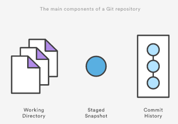
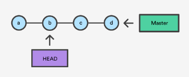
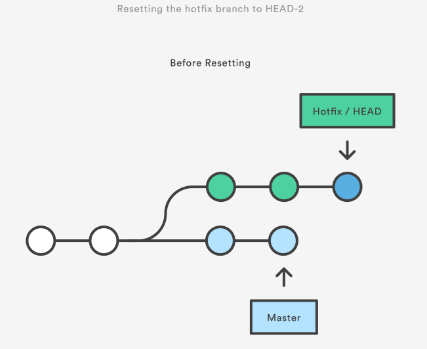
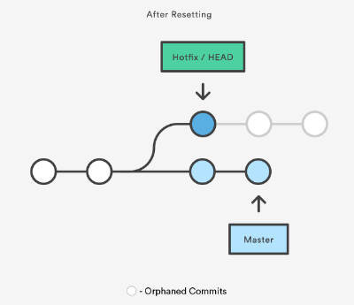
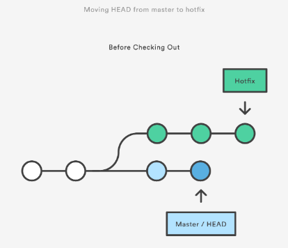
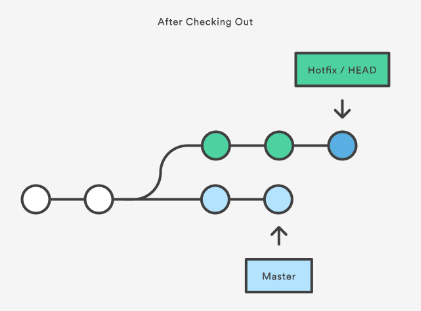
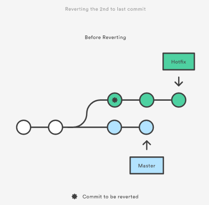
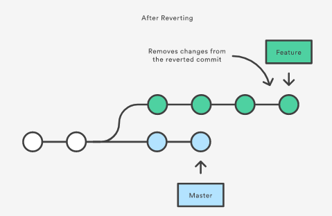

## Resetting, Checking Out & Reverting

The [git reset](#git-reset), [git checkout](#git-checkout), and [git revert](#git-revert) commands are some of the most useful tools in your Git toolbox. They all let you undo some kind of change in your repository, and the first two commands can be used to manipulate either commits or individual files.

Because they’re so similar, it’s very easy to mix up which command should be used in any given development scenario. In this article, we’ll compare the most common configurations of `git reset`, `git checkout`, and `git revert`. Hopefully, you’ll walk away with the confidence to navigate your repository using any of these commands.



It helps to think about each command in terms of their effect on the three state management mechanisms of a Git repository: the working directory, the staged snapshot, and the commit history. These components are sometimes known as "The three trees" of Git. We explore the three trees in depth on the [git reset](#git-reset) page. Keep these mechanisms in mind as you read through this article.

A checkout is an operation that moves the HEAD ref pointer to a specified commit. To demonstrate this consider the following example.


This example demonstrates a sequence of commits on the `master` branch. The HEAD ref and `master` branch ref currently point to commit `d`. Now let us execute `git checkout b`



This is an update to the "Commit History" tree. The `git checkout` command can be used in a commit, or file level scope. A file level checkout will change the file's contents to those of the specific commit.

A revert is an operation that takes a specified commit and creates a new commit which inverses the specified commit. `git revert` can only be run at a commit level scope and has no file level functionality.

A reset is an operation that takes a specified commit and resets the "three trees" to match the state of the repository at that specified commit. A reset can be invoked in three different modes which correspond to the three trees.

Checkout and reset are generally used for making local or private 'undos'. They modify the history of a repository that can cause conflicts when pushing to remote shared repositories. Revert is considered a safe operation for 'public undos' as it creates new history which can be shared remotely and doesn't overwrite history remote team members may be dependent on.

### Git Reset vs Revert vs Checkout reference

The table below sums up the most common use cases for all of these commands. Be sure to keep this reference handy, as you’ll undoubtedly need to use at least some of them during your Git career.

| *Command*    | *Scope*      | *Common use cases*                                                   |
| -------------| ------------ | -------------------------------------------------------------------- |
| git reset    | Commit-level | Discard commits in a private branch or throw away uncommited changes |
| git reset	   | File-level   | Unstage a file                                                       |
| git checkout | Commit-level | Switch between branches or inspect old snapshots                     |
| git checkout | File-level   | Discard changes in the working directory                             |
| git revert   | Commit-level | Undo commits in a public branch                                      |
| git revert   | File-level   | (N/A)                                                                | 

### Commit Level Operations

The parameters that you pass to `git reset` and `git checkout` determine their scope. When you don’t include a file path as a parameter, they operate on whole commits. That’s what we’ll be exploring in this section. Note that `git revert` has no file-level counterpart.

#### Reset A Specific Commit

On the commit-level, resetting is a way to move the tip of a branch to a different commit. This can be used to remove commits from the current branch. For example, the following command moves the hotfix branch backwards by two commits.

```
git checkout hotfix
git reset HEAD~2
```

The two commits that were on the end of `hotfix` are now dangling, or orphaned commits. This means they will be deleted the next time Git performs a garbage collection. In other words, you’re saying that you want to throw away these commits. This can be visualized as the following:





This usage of `git reset` is a simple way to undo changes that haven’t been shared with anyone else. It’s your go-to command when you’ve started working on a feature and find yourself thinking, “Oh crap, what am I doing? I should just start over.”

In addition to moving the current branch, you can also get git reset to alter the staged snapshot and/or the working directory by passing it one of the following flags:  
- `--soft` – The staged snapshot and working directory are not altered in any way.
- `--mixed` – The staged snapshot is updated to match the specified commit, but the working directory is not affected. This is the default option.
- `--hard` – The staged snapshot and the working directory are both updated to match the specified commit.
 
It’s easier to think of these modes as defining the scope of a `git reset` operation. For further detailed information visit the [git reset](#git-reset) page.

#### Checkout old commits

The `git checkout` command is used to update the state of the repository to a specific point in the projects history. When passed with a branch name, it lets you switch between branches.

```
git checkout hotfix
```

Internally, all the above command does is move HEAD to a different branch and update the working directory to match. Since this has the potential to overwrite local changes, Git forces you to commit or [stash](#git-stash) any changes in the working directory that will be lost during the checkout operation. Unlike `git reset`, `git checkout` doesn’t move any branches around.





You can also check out arbitrary commits by passing the commit reference instead of a branch. This does the exact same thing as checking out a branch: it moves the HEAD reference to the specified commit. For example, the following command will check out the grandparent of the current commit:

```
git checkout HEAD~2
```


This is useful for quickly inspecting an old version of your project. However, since there is no branch reference to the current HEAD, this puts you in a detached HEAD state. This can be dangerous if you start adding new commits because there will be no way to get back to them after you switch to another branch. For this reason, you should always create a new branch before adding commits to a detached HEAD.

#### Undo Public Commits with Revert

Reverting undoes a commit by creating a new commit. This is a safe way to undo changes, as it has no chance of re-writing the commit history. For example, the following command will figure out the changes contained in the 2nd to last commit, create a new commit undoing those changes, and tack the new commit onto the existing project.

```
git checkout hotfix
git revert HEAD~2
```

This can be visualized as the following:





Contrast this with `git reset`, which *does* alter the existing commit history. For this reason, git revert should be used to undo changes on a public branch, and `git reset` should be reserved for undoing changes on a private branch.

You can also think of `git revert` as a tool for undoing *committed* changes, while `git reset HEAD` is for undoing *uncommitted* changes.

Like `git checkout`, `git revert` has the potential to overwrite files in the working directory, so it will ask you to commit or [stash changes](#git-stash) that would be lost during the revert operation.

### File-level Operations

The `git reset` and `git checkout` commands also accept an optional file path as a parameter. This dramatically alters their behavior. Instead of operating on entire snapshots, this forces them to limit their operations to a single file.

#### Git Reset A Specific File

When invoked with a file path, `git reset` updates the *staged snapshot* to match the version from the specified commit. For example, this command will fetch the version of `foo.py` in the 2nd-to-last commit and stage it for the next commit:

```
git reset HEAD~2 foo.py
```

As with the commit-level version of `git reset`, this is more commonly used with HEAD rather than an arbitrary commit. Running `git reset HEAD foo.py` will unstage `foo.py`. The changes it contains will still be present in the working directory.


The `--soft`, `--mixed`, and `--hard` flags do not have any effect on the file-level version of `git reset`, as the staged snapshot is *always* updated, and the working directory is *never* updated.

#### Git Checkout File

Checking out a file is similar to using `git reset` with a file path, except it updates the *working directory* instead of the stage. Unlike the commit-level version of this command, this does not move the HEAD reference, which means that you won’t switch branches.


For example, the following command makes `foo.py` in the working directory match the one from the 2nd-to-last commit:

```
git checkout HEAD~2 foo.py
```

Just like the commit-level invocation of `git checkout`, this can be used to inspect old versions of a project—but the scope is limited to the specified file.

If you stage and commit the checked-out file, this has the effect of “reverting” to the old version of that file. Note that this removes *all* of the subsequent changes to the file, whereas the `git revert` command undoes only the changes introduced by the specified commit.

Like `git reset`, this is commonly used with HEAD as the commit reference. For instance, `git checkout HEAD foo.py` has the effect of discarding unstaged changes to `foo.py`. This is similar behavior to `git reset HEAD --hard`, but it operates only on the specified file.

### Summary

You should now have all the tools you could ever need to undo changes in a Git repository. The [git reset](#git-reset), [git checkout](#git-checkout), and [git revert](#git-revert) commands can be confusing, but when you think about their effects on the working directory, staged snapshot, and commit history, it should be easier to discern which command fits the development task at hand.
 