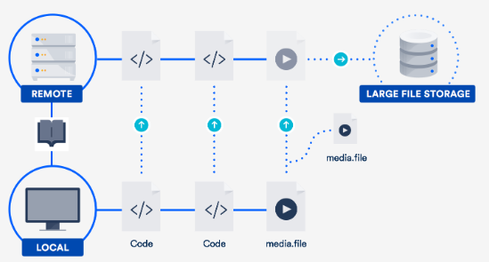

## Large reposiories in Git

Git is a fantastic choice for tracking the evolution of your code base and collaborating efficiently with your peers. But what happens when the repository you want to track is really **really** big?

In this post I’ll give you some techniques for dealing with it.

### Two categories of big repositories

If you think about it there are broadly two major reasons for repositories growing massive:  
- They accumulate a very very long history (the project grows over a very long period of time and the baggage accumulates)
- They include huge binary assets that need to be tracked and paired  together with code.

…or it could be both.

Sometimes the second type of problem is compounded by the fact that old, deprecated binary artifacts are still stored in the repository. But there’s a moderately easy – if annoying – fix for that (see below).

The techniques and workarounds for each scenario are different, though sometimes complementary. So I’ll cover them separately.

### Cloning repositories with a very long history

Even though threshold for a qualifying a repository as “massive” is pretty high, they’re still a pain to clone. And you can’t always avoid long histories. Some repos have to be kept in tact for legal or regulatory reasons.

#### Simple solution: git shallow clone

The first solution to a fast clone and saving developer’s and system’s time and disk space is to copy only recent revisions. Git’s shallow clone option allows you to pull down only the latest n commits of the repo’s history.

How do you do it? Just use the –depth option. For example:

```
git clone --depth [depth] [remote-url]
``` 

Imagine you accumulated ten or more years of project history in your repository. For example, we migrated [Jira](https://www.atlassian.com/software/jira) (an 11 year-old code base) to Git. The time savings for repos like this can add up and be very noticeable.

The full clone of Jira is 677MB, with the working directory being another 320MB, made up of more than 47,000+ commits. A shallow clone of the repo takes 29.5 seconds, compared to 4 minutes 24 seconds for a full clone with all the history. The benefit grows proportionately to how many binary assets your project has swallowed over time.

Tip: [Build systems connected to your Git repo](https://www.atlassian.com/continuous-delivery/continuous-integration/ci-friendly-git-repos) benefit from shallow clones, too!

Shallow clones used to be somewhat impaired citizens of the Git world as some operations were barely supported. But recent versions ([1.9](https://www.atlassian.com/blog/archives/whats-new-git-1-9?_ga=2.85910233.1564368919.1571097409-1339596144.1562091064) and above) have improved the situation greatly, and you can properly pull and push to repositories even from a shallow clone now.

#### Surgical solution: git filter branch

For the huge repositories that have lots of binary cruft committed by mistake, or old assets not needed anymore, a great solution is to use `git filter-branch`. The command lets you walk through the entire history of the project filtering out, modifying, and skipping files according to predefined patterns.

It is a very powerful tool once you’ve identified where your repo is heavy. There are helper scripts available to identify big objects, so that part should be easy enough.
The syntax goes like this:

```
git filter-branch --tree-filter 'rm -rf [/path/to/spurious/asset/folder]'
```

`git filter-branch` has a minor drawback, though: once you use *_filter-branch_*, you effectively rewrite the entire history of your project. That is, all commit ids change. This requires every developer to re-clone the updated repository.

So if you’re planning to carry out a cleanup action using `git filter-branch`, you should alert your team, plan a short freeze while the operation is carried out, and then notify everyone that they should clone the repository again.

Tip: More on `git filter-branch` in [this post about tearing apart your Git repo](https://www.atlassian.com/blog/git/tear-apart-repository-git-way?_ga=2.116821446.1564368919.1571097409-1339596144.1562091064).

#### Alternative to git shallow-clone: clone only one branch

Since git 1.7.10, you can also limit the amount of history you clone by cloning a single branch, like so:

```
git clone [remote url] --branch [branch_name] --single-branch [folder]
```

This specific hack is useful when you’re working with long running and divergent branches, or if you have lots branches and only ever need to work with a few of them. If you only have a handful of branches with very few differences you probably won’t see a huge difference using this.

### Managing repositories with huge binary assets

The second type of big repository is those with huge binary assets. This is something [many different kinds of software (and non-software!) teams encounter](https://www.atlassian.com/blog/git/git-lfs-for-designers-game-developers-architects?_ga=2.42796773.1564368919.1571097409-1339596144.1562091064). Gaming teams have to juggle around huge 3D models, web development teams might need to track raw image assets, CAD teams might need to manipulate and track the status of binary deliverables.

Git is not especially bad at handling binary assets, but it’s not especially good either. By default, Git will compress and store all subsequent full versions of the binary assets, which is obviously not optimal if you have many.

There are some basic tweaks that improve the situation, like running the garbage collection (`git gc`), or tweaking the usage of delta commits for some binary types in `.gitattributes`.

But it’s important to reflect on the nature of your project’s binary assets, as that will help you determine the winning approach. For example, here are some points to consider:  
- For binary files that change significantly – and not just some meta data headers – the delta compression is probably going to be useless. So use `delta off` for those files to avoid the unnecessary delta compression work as part of the repack.
- In the scenario above, it’s likely that those files don’t zlib compress very well either so you could turn compression off with `core.compression 0` or `core.loosecompression 0`. That’s a global setting that would negatively affect all the non-binary files that actually compress well so this makes sense if you split the binary assets into a separate repository.
- It’s important to remember that `git gc` turns the “duplicated” loose objects into a single pack file. But again, unless the files compress in some way, that probably won’t make any significant difference in the resulting pack file.
- Explore the tuning of `core.bigFileThreshold`. Anything larger than 512MB won’t be delta compressed anyway (without having to set `.gitattributes`) so maybe that’s something worth tweaking.

#### Solution for big folder trees: git sparse-checkout

A mild help to the binary assets problem is Git’s sparse checkout option (available since Git 1.7.0). This technique allows to keep the working directory clean by explicitly detailing which folders you want to populate. Unfortunately, it does not affect the size of the overall local repository, but can be helpful if you have a huge tree of folders.

What are the involved commands? Here’s an example:  
- Clone the full repository once: `git clone`
- Activate the feature: `git config core.sparsecheckout true`
- Add folders that are needed explicitly, ignoring assets folders:
    ```
    echo src/ › .git/info/sparse-checkout
    ```
- Read the tree as specified:
    ```
    git read-tree -m -u HEAD
    ```

After the above, you can go back to use your normal git commands, but your work directory will only contain the folders you specified above.

#### Solution for controlling when you update large files: submodules

Another way to handle huge binary asset folders is to split those into a separate repository and pull the assets in your main project using Git submodules. This gives you a way to control when you update the assets. See more on submodules in these posts: [Git submodules core concept and tips](https://www.atlassian.com/blog/git/git-submodules-core-concept-workflows-and-tips?_ga=2.41412194.1564368919.1571097409-1339596144.1562091064), and [alternatives to Git submodules](https://www.atlassian.com/git/tutorials/git-subtree).

### [UPDATE] …or you can skip all that and use Git LFS

If you work with large files on a regular basis, the best solution might be to take advantage of the large file support (LFS) Atlassian co-developed with GitHub in 2015. (Yes, you read that right. We teamed up with GitHub on an open-source contribution to the Git project.)

Git LFS is an extension that stores pointers (naturally!) to large files in your repository, instead of storing the files themselves in there. The actual files are stored on a remote server. As you can imagine, this dramatically reduces the time it takes to clone your repo.



[Bitbucket supports Git LFS](https://www.atlassian.com/blog/git/git-lfs-for-designers-game-developers-architects?_ga=2.39759587.1564368919.1571097409-1339596144.1562091064), as does GitHub. So chances are, you already have access to this technology. It’s especially helpful for teams that include designers, videographers, musicians, or CAD users.

### Conclusions

Don’t give up the fantastic capabilities of Git just because you have a big repository history or huge files. There are workable solutions to both problems.

Check out the other articles I linked to above for more info on submodules, project dependencies, and Git LFS. And for refreshers on commands and workflow, our [Git microsite](https://www.atlassian.com/git) has loads of tutorials. Happy coding!
