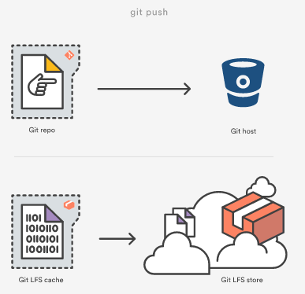
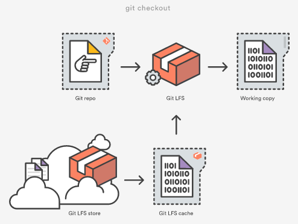
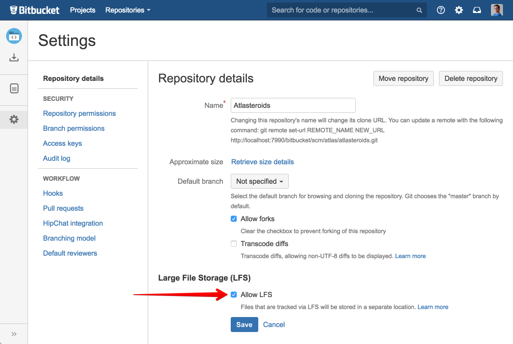
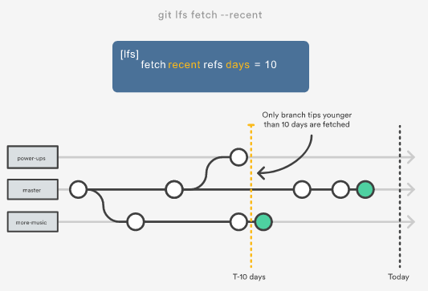
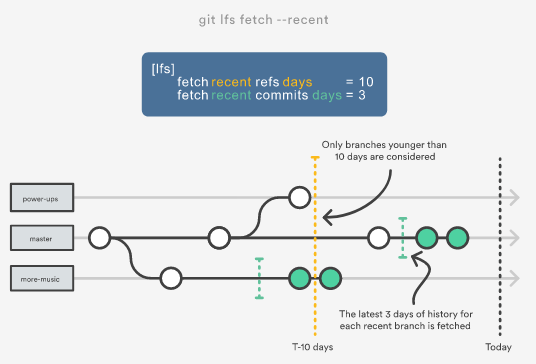
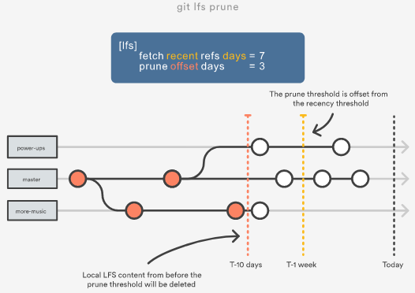
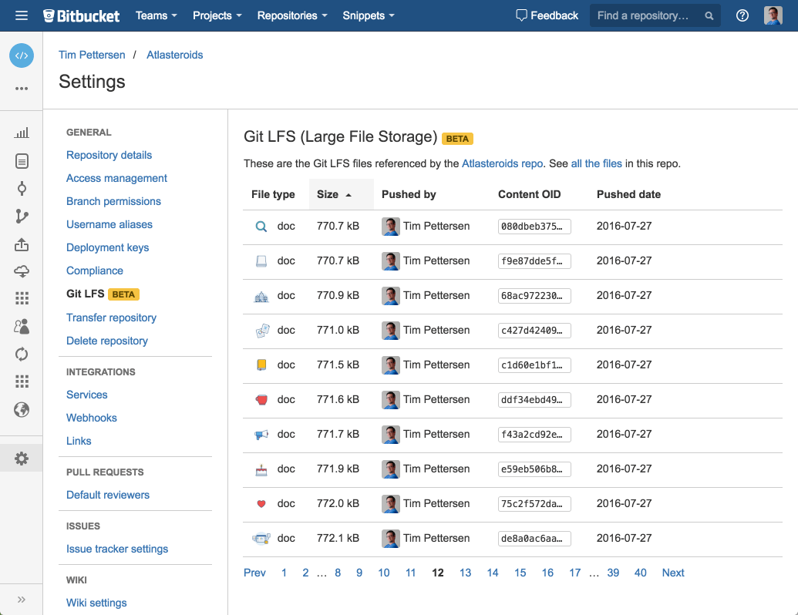

## Git LFS

### What is Git LFS?

Git is a *distributed* version control system, meaning the entire history of the repository is transferred to the client during the cloning process. For projects containing large files, particularly large files that are modified regularly, this initial clone can take a huge amount of time, as every version of every file has to be downloaded by the client. Git LFS (Large File Storage) is a Git extension developed by Atlassian, GitHub, and a few other open source contributors, that reduces the impact of large files in your repository by downloading the relevant versions of them *lazily*. Specifically, large files are downloaded during the checkout process rather than during cloning or fetching.

Git LFS does this by replacing large files in your repository with tiny *pointer* files. During normal usage, you'll never see these pointer files as they are handled automatically by Git LFS:  
1. When you add a file to your repository, Git LFS replaces its contents with a pointer, and stores the file contents in a local Git LFS cache.
  
2. When you push new commits to the server, any Git LFS files referenced by the newly pushed commits are transferred from your local Git LFS cache to the remote Git LFS store tied to your Git repository. 
  
3. When you checkout a commit that contains Git LFS pointers, they are replaced with files from your local Git LFS cache, or downloaded from the remote Git LFS store. 
  

Git LFS is seamless: in your working copy you'll only see your actual file content. This means you can use Git LFS without changing your existing Git workflow; you simply `git checkout`, edit, `git add`, and `git commit` as normal. `git clone` and `git pull` operations will be significantly faster as you only download the versions of large files referenced by commits that you *actually* check out, rather than every version of the file that ever existed.

To use Git LFS, you will need a Git LFS aware host such as [Bitbucket Cloud](https://bitbucket.org/) or [Bitbucket Server](https://www.atlassian.com/software/bitbucket/server). Repository users will need to have the [Git LFS command-line client installed](#installing-git-lfs), or a Git LFS aware GUI client such as [Sourcetree](https://www.sourcetreeapp.com/). Fun fact: Steve Streeting, the Atlassian developer who invented Sourcetree, is also a major contributor to the Git LFS project, so Sourcetree and Git LFS work together rather well.

### Installing Git LFS

1. There are three easy ways to install Git LFS:  
  a. Install it using your favorite package manager. `git-fls` packages are available for Homebrew, MacPorts, dnf, and [packagecloud](https://github.com/github/git-lfs/blob/master/INSTALLING.md); or  
  b. Download and install [Git LFS](https://git-lfs.github.com/) from the project website; or  
  c. Install [Sourcetree](https://www.sourcetreeapp.com/), a free Git GUI client that comes bundled with Git LFS.

2. Once `git-lfs` is on your path, run `git lfs install` to initialize Git LFS (you can skip this step if you installed Sourcetree):
    ```
    $ git lfs install
    Git LFS initialized.
    ```
   You'll only need to run git lfs install once. Once initialized for your system, Git LFS will bootstrap itself automatically when you clone a repository containing Git LFS content.

### Creating a new Git LFS repository

To create a new Git LFS aware repository, you'll need to run `git lfs install` after you create the repository:

```
# initialize Git
$ mkdir Atlasteroids
$ cd Atlasteroids
$ git init
Initialized empty Git repository in /Users/tpettersen/Atlasteroids/.git/
 
# initialize Git LFS
$ git lfs install
Updated pre-push hook.
Git LFS initialized.
```

This installs a special `pre-push` [Git hook](#git-hooks) in your repository that will transfer Git LFS files to the server when you `git push`.

Git LFS is automatically enabled for all [Bitbucket Cloud](https://bitbucket.org/) repositories. For [Bitbucket Server](https://www.atlassian.com/software/bitbucket/server), you'll need to enable Git LFS in your repository settings:



Once Git LFS is initialized for your repository, you can specify which files to track using [git lfs track](#tracking-files-with-git-lfs).

### Cloning an existing Git LFS repository

Once Git LFS is installed, you can clone a Git LFS repository as normal using `git clone`. At the end of the cloning process Git will check out the default branch (usually `master`), and any Git LFS files needed to complete the checkout process will be automatically downloaded for you. For example:

```
$ git clone git@bitbucket.org:tpettersen/Atlasteroids.git
Cloning into 'Atlasteroids'...
remote: Counting objects: 156, done.
remote: Compressing objects: 100% (154/154), done.
remote: Total 156 (delta 87), reused 0 (delta 0)
Receiving objects: 100% (156/156), 54.04 KiB | 31.00 KiB/s, done.
Resolving deltas: 100% (87/87), done.
Checking connectivity... done.
Downloading Assets/Sprites/projectiles-spritesheet.png (21.14 KB)
Downloading Assets/Sprites/productlogos_cmyk-spritesheet.png (301.96 KB)
Downloading Assets/Sprites/shuttle2.png (1.62 KB)
Downloading Assets/Sprites/space1.png (1.11 MB)
Checking out files: 100% (81/81), done.
```

There are four PNGs in this repository being tracked by Git LFS. When running `git clone`, Git LFS files are downloaded one at a time as pointer files are checked out of your repository.

### Speeding up clones

If you're cloning a repository with a large number of LFS files, the explicit git lfs clone command offers far better performance:

```
$ git lfs clone git@bitbucket.org:tpettersen/Atlasteroids.git
Cloning into 'Atlasteroids'...
remote: Counting objects: 156, done.
remote: Compressing objects: 100% (154/154), done.
remote: Total 156 (delta 87), reused 0 (delta 0)
Receiving objects: 100% (156/156), 54.04 KiB | 0 bytes/s, done.
Resolving deltas: 100% (87/87), done.
Checking connectivity... done.
Git LFS: (4 of 4 files) 1.14 MB / 1.15 MB
```

Rather than downloading Git LFS files one at a time, the `git lfs clone` command waits until the checkout is complete, and then downloads any required Git LFS files as a batch. This takes advantage of parallelized downloads, and dramatically reduces the number of HTTP requests and processes spawned (which is especially important for improving performance on Windows).

### Pulling and checking out

Just like cloning, you can pull from a Git LFS repository using a normal `git pull`. Any needed Git LFS files will be downloaded as part of the automatic checkout process once the pull completes:

```
$ git pull
Updating 4784e9d..7039f0a
Downloading Assets/Sprites/powerup.png (21.14 KB)
Fast-forward
 Assets/Sprites/powerup.png | 3 +
 Assets/Sprites/powerup.png.meta | 4133 ++++++++++++++++++++++++++++++++++++++++++++++++++++++++++++++++++++
 2 files changed, 4136 insertions(+)
 create mode 100644 Assets/Sprites/projectiles-spritesheet.png
 create mode 100644 Assets/Sprites/projectiles-spritesheet.png.meta
```

No explicit commands are needed to retrieve Git LFS content. However, if the checkout fails for an unexpected reason, you can download any missing Git LFS content for the current commit with `git lfs pull`:

```
$ git lfs pull
Git LFS: (4 of 4 files) 1.14 MB / 1.15 MB
Speeding up pulls
```

Like `git lfs clone`, `git lfs pull` downloads your Git LFS files as a batch. If you know a large number of files have changed since the last time you pulled, you may wish to disable the automatic Git LFS download during checkout, and then batch download your Git LFS content with an explicit `git lfs pull`. This can be done by overriding your Git config with the `-c` option when you invoke `git pull`:

```
$ git -c filter.lfs.smudge= -c filter.lfs.required=false pull && git lfs pull
```

Since that's rather a lot of typing, you may wish to create a simple [Git alias](https://blogs.atlassian.com/2014/10/advanced-git-aliases/) to perform a batched Git and Git LFS pull for you:

```
$ git config --global alias.plfs "\!git -c filter.lfs.smudge= -c filter.lfs.required=false pull && git lfs pull"
$ git plfs
```

This will greatly improve performance when a large number of Git LFS files need to be downloaded (again, especially on Windows).

### Tracking files with Git LFS

When you add a new type of large file to your repository, you'll need to tell Git LFS to track it by specifying a pattern using the `git lfs track` command:

```
$ git lfs track "*.ogg"
Tracking *.ogg
```

Note that the quotes around `*.ogg` are important. Omitting them will cause the wildcard to be expanded by your shell, and individual entries will be created for each `.ogg` file in your current directory:

```
# probably not what you want
$ git lfs track *.ogg
Tracking explode.ogg
Tracking music.ogg
Tracking phaser.ogg
```

The patterns supported by Git LFS are the same as those supported by [.gitignore](#gitignore), for example:

```
# track all .ogg files in any directory
$ git lfs track "*.ogg"
 
# track files named music.ogg in any directory
$ git lfs track "music.ogg"
 
# track all files in the Assets directory and all subdirectories
$ git lfs track "Assets/"
 
# track all files in the Assets directory but *not* subdirectories
$ git lfs track "Assets/*"
 
# track all ogg files in Assets/Audio
$ git lfs track "Assets/Audio/*.ogg"
 
# track all ogg files in any directory named Music
$ git lfs track "**/Music/*.ogg"
 
# track png files containing "xxhdpi" in their name, in any directory
$ git lfs track "*xxhdpi*.png
```

These patterns are relative to the directory in which you ran the `git lfs track` command. To keep things simple, it is best to run `git lfs track` from the root of your repository. Note that Git LFS does not support *negative patterns* like `.gitignore` does.

After running `git lfs track`, you'll notice a new file named `.gitattributes` in the directory you ran the command from. `.gitattributes` is a Git mechanism for binding special behaviors to certain file patterns. Git LFS automatically creates or updates `.gitattributes` files to bind tracked file patterns to the Git LFS filter. However, you will need to commit any changes to the `.gitattributes` file to your repository yourself:

```
$ git lfs track "*.ogg"
Tracking *.ogg
 
$ git add .gitattributes
 
$ git diff --cached
diff --git a/.gitattributes b/.gitattributes
new file mode 100644
index 0000000..b6dd0bb
--- /dev/null
+++ b/.gitattributes
@@ -0,0 +1 @@
+*.ogg filter=lfs diff=lfs merge=lfs -text
 
$ git commit -m "Track ogg files with Git LFS"
```

For ease of maintenance, it is simplest to keep all Git LFS patterns in a single `.gitattributes` file by always running `git lfs track` from the root of your repository. However, you can display a list of all patterns that are currently tracked by Git LFS (and the `.gitattributes` files they are defined in) by invoking `git lfs track` with no arguments:

```
$ git lfs track
Listing tracked paths
 *.stl (.gitattributes)
 *.png (Assets/Sprites/.gitattributes)
 *.ogg (Assets/Audio/.gitattributes)
```

You can stop tracking a particular pattern with Git LFS by simply removing the appropriate line from your `.gitattributes` file, or by running the `git lfs untrack` command:

```
$ git lfs untrack "*.ogg"
Untracking *.ogg
$ git diff
diff --git a/.gitattributes b/.gitattributes
index b6dd0bb..e69de29 100644
--- a/.gitattributes
+++ b/.gitattributes
@@ -1 +0,0 @@
-*.ogg filter=lfs diff=lfs merge=lfs -text
```

After running `git lfs untrack` you will again have to commit the changes to `.gitattributes` yourself.

### Committing and pushing

You can commit and push as normal to a repository that contains Git LFS content. If you have committed changes to files tracked by Git LFS, you will see some additional output from git push as the Git LFS content is transferred to the server:

```
$ git push
Git LFS: (3 of 3 files) 4.68 MB / 4.68 MB 
Counting objects: 8, done.
Delta compression using up to 8 threads.
Compressing objects: 100% (8/8), done.
Writing objects: 100% (8/8), 1.16 KiB | 0 bytes/s, done.
Total 8 (delta 1), reused 0 (delta 0)
To git@bitbucket.org:tpettersen/atlasteroids.git
 7039f0a..b3684d3 master -> master
```

If transferring the LFS files fails for some reason, the push will be aborted and you can safely try again. Like Git, Git LFS storage is *content addressable*: content is stored against a key which is a SHA-256 hash of the content itself. This means it is always safe to re-attempt transferring Git LFS files to the server; you can't accidentally overwrite a Git LFS file's contents with the wrong version.

### Moving a Git LFS repository between hosts

To migrate a Git LFS repository from one hosting provider to another, you can use a combination of `git lfs fetch` and `git lfs push` with the `--all` option specified.

For example, to move all Git and Git LFS repository from a remote named `github` to a remote named `bitbucket`:

```
# create a bare clone of the GitHub repository
$ git clone --bare git@github.com:kannonboy/atlasteroids.git
$ cd atlasteroids
 
# set up named remotes for Bitbucket and GitHub
$ git remote add bitbucket git@bitbucket.org:tpettersen/atlasteroids.git
$ git remote add github git@github.com:kannonboy/atlasteroids.git
 
# fetch all Git LFS content from GitHub
$ git lfs fetch --all github
 
# push all Git and Git LFS content to Bitbucket
$ git push --mirror bitbucket
$ git lfs push --all bitbucket
```

### Fetching extra Git LFS history

Git LFS typically only downloads the files needed for commits that you actually checkout locally. However, you can force Git LFS to download extra content for other recently modified branches using `git lfs fetch --recent`:

```
$ git lfs fetch --recent
Fetching master
Git LFS: (0 of 0 files, 14 skipped) 0 B / 0 B, 2.83 MB skipped Fetching recent branches within 7 days
Fetching origin/power-ups
Git LFS: (8 of 8 files, 4 skipped) 408.42 KB / 408.42 KB, 2.81 MB skipped
Fetching origin/more-music
Git LFS: (1 of 1 files, 14 skipped) 1.68 MB / 1.68 MB, 2.83 MB skipped
```

This is useful for batch downloading new Git LFS content while you're out at lunch, or if you're planning on reviewing work from your teammates and will not be able to download content later on due to limited internet connectivity. For example, you may wish to run `git lfs fetch --recent` before jumping on a plane!

Git LFS considers any branch or tag containing a commit newer than seven days as recent. You can configure the number of days considered as recent by setting the `lfs.fetchrecentrefsdays` property:

```
# download Git LFS content for branches or tags updated in the last 10 days
$ git config lfs.fetchrecentrefsdays 10
```

By default, `git lfs fetch --recent` will only download Git LFS content for the commit at the tip of a recent branch or tag.



However you can configure Git LFS to download content for earlier commits on recent branches and tags by configuring the `lfs.fetchrecentcommitsdays` property:

```
# download the latest 3 days of Git LFS content for each recent branch or tag
$ git config lfs.fetchrecentcommitsdays 3
```

Use this setting with care: if you have fast moving branches, this can result in a *huge* amount of data being downloaded. However it can be useful if you need to review interstitial changes on a branch, cherry picking commits across branches, or rewrite history.



As discussed in [Moving a Git LFS repository between hosts](#moving-a-git-lfs-repository-between-hosts), you can also elect to fetch *all* Git LFS content for your repository with `git lfs fetch --all`:

```
$ git lfs fetch --all
Scanning for all objects ever referenced...
✔ 23 objects found 
Fetching objects...
Git LFS: (9 of 9 files, 14 skipped) 2.06 MB / 2.08 MB, 2.83 MB skipped
```

### Deleting local Git LFS files

You can delete files from your local Git LFS cache with the `git lfs prune` command:

```
$ git lfs prune
✔ 4 local objects, 33 retained 
Pruning 4 files, (2.1 MB)
✔ Deleted 4 files
```

This will delete any local Git LFS files that are considered *old*. An old file is any file **not** referenced by:  
- the currently checked out commit
- a commit that has not yet been pushed (to origin, or whatever `lfs.pruneremotetocheck` is set to)
- a recent commit

By default, a recent commit is any commit created in the last *ten* days. This is calculated by adding:  
- the value of the `lfs.fetchrecentrefsdays` property discussed in [Fetching extra Git LFS history](#fetching-extra-git-lfs-history) (which defaults to *seven*); to
- the value of the `lfs.pruneoffsetdays` property (which defaults to *three*)



You can configure the prune offset to retain Git LFS content for a longer period:

```
# don't prune commits younger than four weeks (7 + 21)
$ git config lfs.pruneoffsetdays 21
```

Unlike Git's built-in garbage collection, Git LFS content is *not* pruned automatically, so running `git lfs prune` on a regular basis is a good idea to keep your local repository size down.

You can test out what effect a prune operation will have with `git lfs prune --dry-run`:

```
$ git lfs prune --dry-run
✔ 4 local objects, 33 retained 
4 files would be pruned (2.1 MB)
```

And exactly which Git LFS objects will be pruned with `git lfs prune --verbose --dry-run`:

```
$ git lfs prune --dry-run --verbose
✔ 4 local objects, 33 retained 
4 files would be pruned (2.1 MB)
 * 4a3a36141cdcbe2a17f7bcf1a161d3394cf435ac386d1bff70bd4dad6cd96c48 (2.0 MB)
 * 67ad640e562b99219111ed8941cb56a275ef8d43e67a3dac0027b4acd5de4a3e (6.3 KB)
 * 6f506528dbf04a97e84d90cc45840f4a8100389f570b67ac206ba802c5cb798f (1.7 MB)
 * a1d7f7cdd6dba7307b2bac2bcfa0973244688361a48d2cebe3f3bc30babcf1ab (615.7 KB)
```

The long hexadecimal strings output by `--verbose` mode are SHA-256 hashes (also known as Object IDs, or OIDs) of the Git LFS objects to be pruned. You can use the techniques described in [Finding paths or commits that reference a Git LFS object](#finding-paths-or-commits-that-reference-a-git-lfs-object) to find our more about the objects that will be pruned.

As an additional safety check, you can use the `--verify-remote` option to check whether the remote Git LFS store has a copy of your Git LFS objects before they are pruned:

```
$ git lfs prune --verify-remote
✔ 16 local objects, 2 retained, 12 verified with remote 
Pruning 14 files, (1.7 MB)
✔ Deleted 14 files
```

This makes the pruning process significantly slower, but gives you peace of mind knowing that any pruned objects are recoverable from the server. You can enable the `--verify-remote` option permanently for your system by configuring the `lfs.pruneverifyremotealways` property globally:

```
$ git config --global lfs.pruneverifyremotealways true
```

Or you can enable remote verification for just the context repository by omitting the `--global` option from the command above.

### Deleting remote Git LFS files from the server

The Git LFS command-line client doesn't support pruning files from the server, so how you delete them depends on your hosting provider.

In Bitbucket Cloud, you can view and delete Git LFS files via **Repository Settings > Git LFS**:



Note that each Git LFS file is indexed by its SHA-256 OID; the paths that reference each file are not visible via the UI. This is because there could be many different paths at many different commits that may refer to a given object, so looking them up would be a very slow process.

To determine what a given Git LFS file actually contains, you have three options:  
- look at the file preview image and file type in the left hand column of the Bitbucket Git LFS UI
- download the file using the link in the right hand column of the Bitbucket Git LFS UI -search for commits referencing the Git LFS object's SHA-256 OID, as discussed in the next section

### Finding paths or commits that reference a Git LFS object

If you have a Git LFS SHA-256 OID, you can determine which commits reference it with `git log --all -p -S <OID>`:

```
$ git log --all -p -S 3b6124b8b01d601fa20b47f5be14e1be3ea7759838c1aac8f36df4859164e4cc
commit 22a98faa153d08804a63a74a729d8846e6525cb0
Author: Tim Pettersen <tpettersen@atlassian.com>
Date: Wed Jul 27 11:03:27 2016 +1000
 
 Projectiles and exploding asteroids
 
diff --git a/Assets/Sprites/projectiles-spritesheet.png
new file mode 100755
index 0000000..49d7baf
--- /dev/null
+++ b/Assets/Sprites/projectiles-spritesheet.png
@@ -0,0 +1,3 @@
+version https://git-lfs.github.com/spec/v1
+oid sha256:3b6124b8b01d601fa20b47f5be14e1be3ea7759838c1aac8f36df4859164e4cc
+size 21647
```

This git log incantation generates a patch (`-p`) from commits on any branch (`--all`) that add or remove a line (`-S`) containing the specified string (a Git LFS SHA-256 OID).

The patch shows you the commit and the path to the LFS object, as well as who added it, and when it was committed. You can simply checkout the commit, and Git LFS will download the file if needed and place it in your working copy.

If you suspect that a particular Git LFS object is in your current HEAD, or on a particular branch, you can use `git grep` to find the file path that references it:

```
# find a particular object by OID in HEAD
$ git grep 3b6124b8b01d601fa20b47f5be14e1be3ea7759838c1aac8f36df4859164e4cc HEAD
HEAD:Assets/Sprites/projectiles-spritesheet.png:oid sha256:3b6124b8b01d601fa20b47f5be14e1be3ea7759838c1aac8f36df4859164e4cc
 
# find a particular object by OID on the "power-ups" branch
$ git grep e88868213a5dc8533fc9031f558f2c0dc34d6936f380ff4ed12c2685040098d4 power-ups
power-ups:Assets/Sprites/shield2.png:oid sha256:e88868213a5dc8533fc9031f558f2c0dc34d6936f380ff4ed12c2685040098d4
```

You can replace HEAD or `power-ups` with any ref, commit, or tree that contains the Git LFS object.

### Including/excluding Git LFS files

In some situations you may want to only download a subset of the available Git LFS content for a particular commit. For example, when configuring a CI build to run unit tests, you may only need your source code, so may want to exclude heavyweight files that aren't necessary to build your code.

You can exclude a pattern or subdirectory using `git lfs fetch -X` (or `--exclude`):

```
$ git lfs fetch -X "Assets/**"
```

Alternatively, you may want to only include a particular pattern or subdirectory. For example, an audio engineer could fetch just ogg and wav files with `git lfs fetch -I` (or `--include`):

```
$ git lfs fetch -I "*.ogg,*.wav"
```

If you combine includes and excludes, only files that match an include pattern *and* do not match an exclude pattern will be fetched. For example, you can fetch everything in your *Assets* directory *except* `gifs` with:

```
$ git lfs fetch -I "Assets/**" -X "*.gif"
```

Excludes and includes support the same patterns as [git lfs track](#tracking-files-with-git-lfs) and `.gitignore`. You can make these patterns permanent for a particular repository by setting the `lfs.fetchinclude` and `lfs.fetchexclude` config properties:

```
$ git config lfs.fetchinclude "Assets/**"
$ git config lfs.fetchexclude "*.gif"
```

These settings can also be applied to every repository on your system by appending the `--global` option.

### Locking Git LFS files

Unfortunately, there is no easy way of resolving binary merge conflicts. With Git LFS file locking, you can lock files by extension or by file name and prevent binary files from being overwritten during a merge.

In order to take advantage of LFS' file locking feature, you first need to tell Git which type of files are lockable. In the example below, the `--lockable` flag is appended to the `git lfs track` command which both stores PSD files in LFS and marks them as lockable.

```
$ git lfs track "*.psd" --lockable
```

Then add the following to your `.gitattributes` file:

```
*.psd filter=lfs diff=lfs merge=lfs -text lockable
```

When preparing to make changes to an LFS file, you'll use the lock command in order to register the file as locked on your Git server.

```
$ git lfs lock images/foo.psd
Locked images/foo.psd
```

Once you no longer need the file lock, you can remove it using Git LFS' unlock command.

```
$ git lfs unlock images/foo.psd
```

Git LFS file locks can be overridden, similar to `git push`, using a `--force` flag. Do not use the `--force` flag unless you’re absolutely sure you know what you’re doing.

```
$ git lfs unlock images/foo.psd --force
```

### How Git LFS works

If you're interested in learning more about clean and smudge filters, pre-push hooks, and the other interesting computer science behind Git LFS, check out [this presentation](https://www.youtube.com/watch?v=w-037RcHjAA) from Atlassian on Git LFS at LinuxCon 2016.
