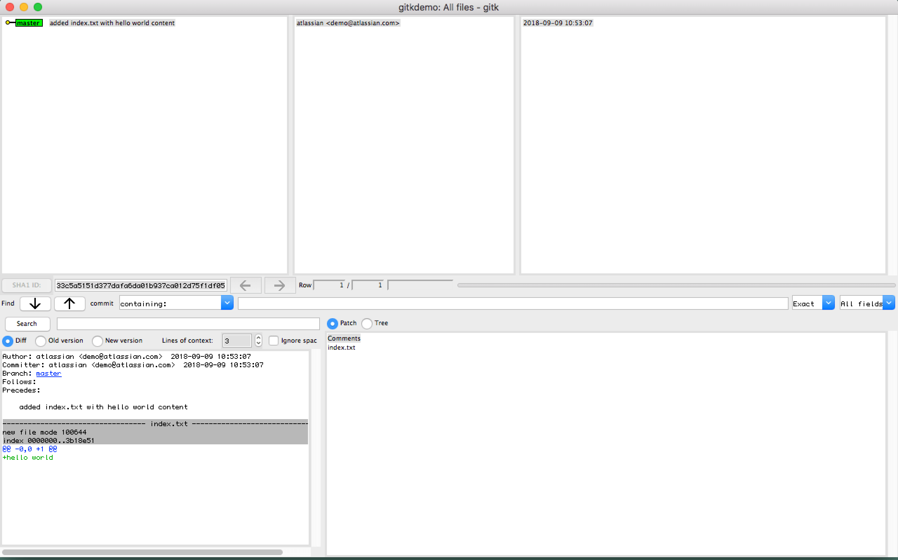
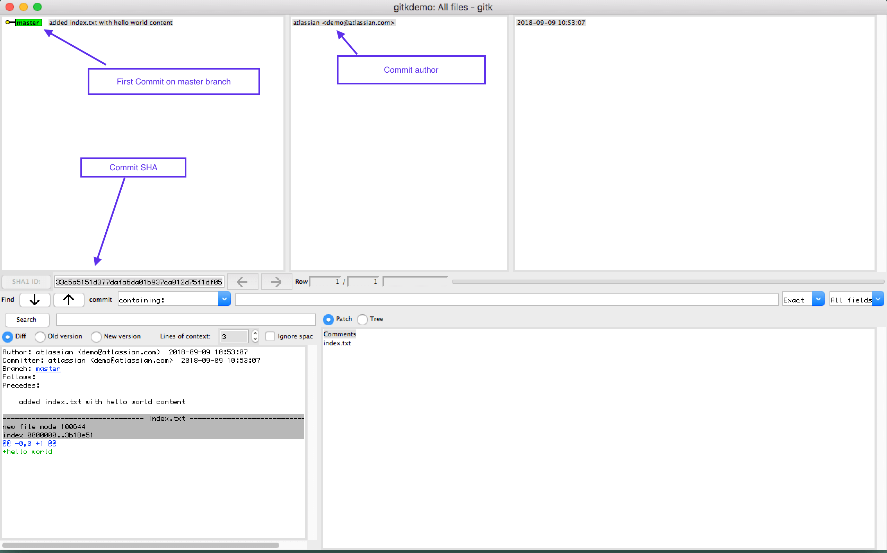
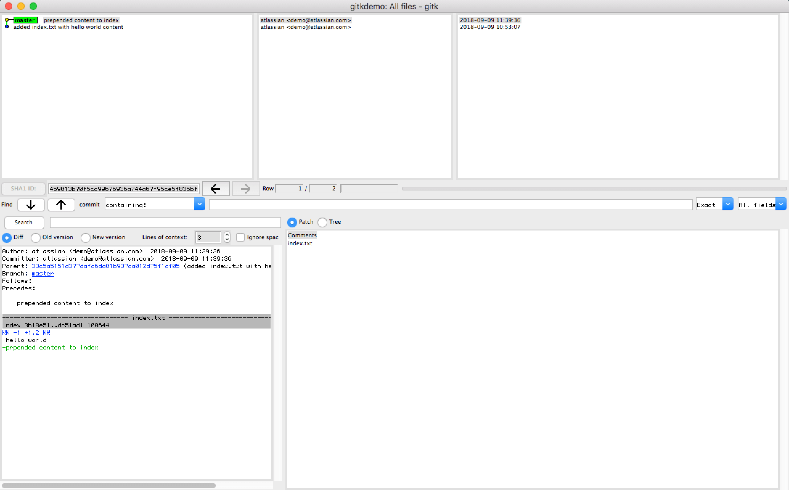
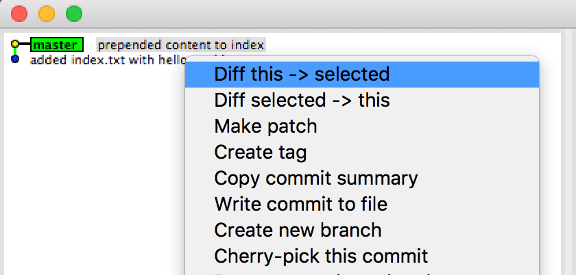
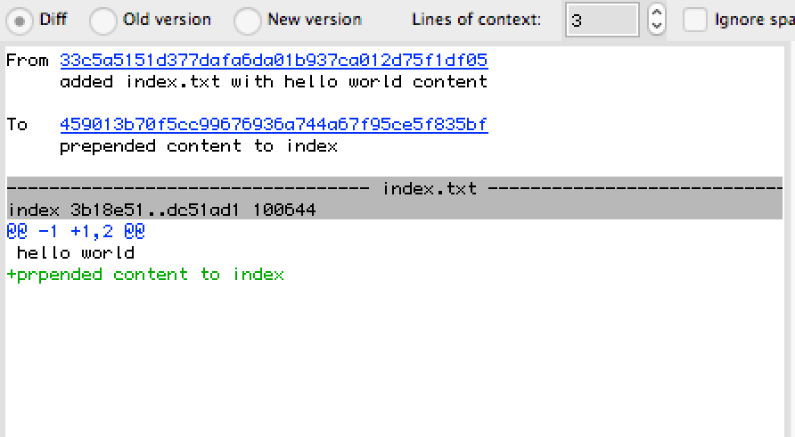
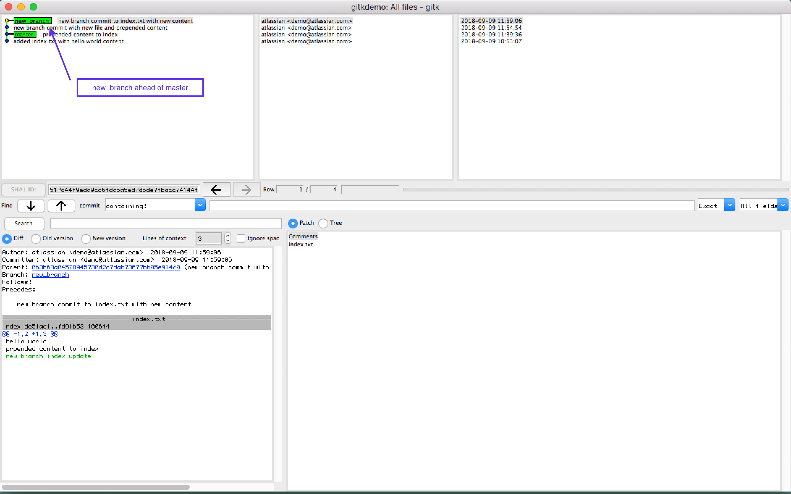
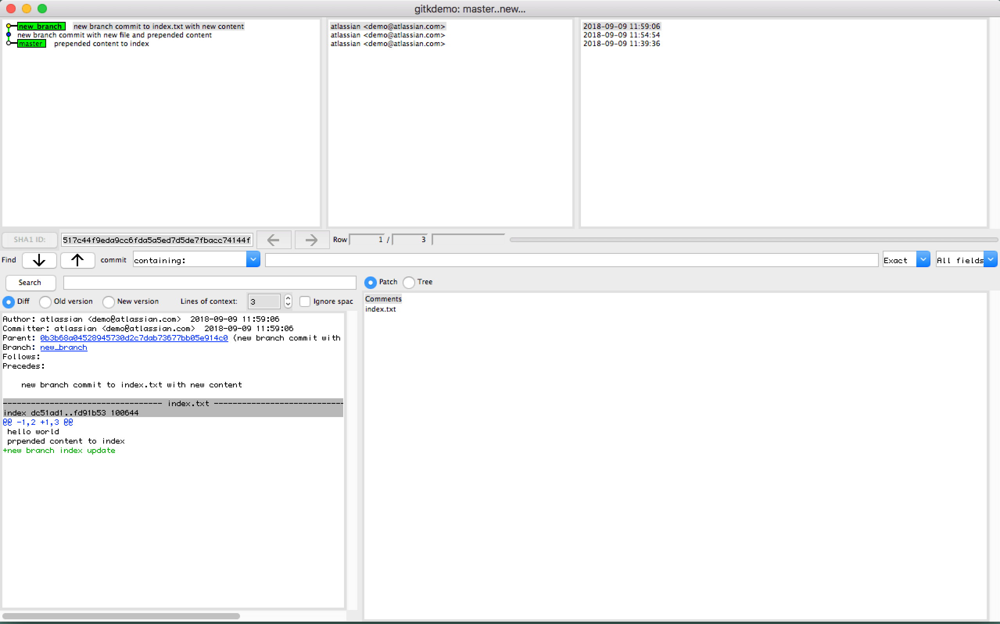

## GitK

Gitk is a graphical repository browser. It was the first of its kind. It can be thought of as a GUI wrapper for [git log](#git-log). It is useful for exploring and visualizing the history of a repository. It’s written in tcl/tk which makes it portable across operating systems. `gitk` is maintained by Paul Mackerras as an independent project, separate from Git core. Stable versions are distributed as part of the Git suite for the convenience of end users. Gitk can be a helpful learning aid for newcomers to Git.

### Gitk Overview

Gitk can be a helpful learning utility for those new to version control, or those transitioning from another version control system like subversion. Gitk is a convenience utility that is packaged with Git core. It provides a graphical user interface that helps with visualization of Git's internal mechanics. Other popular Git GUIs are git-gui and Atlassian's own [Sourcetree](http://www.sourcetreeapp.com/).

### Usage

Gitk is invoked similarly to `git log`. Executing the `gitk` command will launch the Gitk UI which will look similar to the following:



The upper left pane displays the commits to the repository, with the latest on top. The lower right displays the list of files impacted by the selected commit. The lower left pane displays the commit details and full diff. Clicking a file in the lower right pane focuses the diff in the lower left pane to the relevant section.

Gitk will reflect the current state of the repository. If the repository state is modified through separate command line usage like changing branches Gitk will need to be reloaded. Gitk can be reloaded by on the **File menu -> Reload**.

By default Gitk will render the current history of commits. Gitk has a variety of command line options that can be passed on initialization. These options primarily restrict the list of commits rendered to Gitk's top-level view. The general form of execution with these revision options is as follows:

### Options

```
 gitk [] [] [--] […]
```
 
A revision range in the form `<from>..<to>` can be passed to show all revisions between `<from>` and back to `<to>`. Alternatively, a single revision can be passed.

```
...
```

Limit commits to a specific file path. To isolate paths from revision names use `--` to separate the paths from any preceding options.

```
--all
```

```
- ] --tags[=] --remotes[=]
```

```
--branches[=] --tags[=] --remotes[=]
```

Displays the selected item (branches, tags, remotes) as if they were mainline commits. When `<pattern>` is passed, further limits refs to ones matching the specified pattern

```
 --since=
```

Render commits more recent than the specified date.

```
 --until=
```

Render commits older than the specified date.

```
 --date-order
```

Sort commits by date.

```
 --merge
```

Show commits that modify conflicted files that were identified during a merge

```
 --left-right
```

Renders informative labels that indicate which side of a diff commits are from. Commits from the left side are prefixed with a `<` symbol and those from the right with a `>` symbol.

```
 --ancestry-path
```

When given a range of commits to display (e.g. `commit1..commit2` or `commit2 commit1`), only display commits that exist directly on the ancestry chain between the `commit1` and `commit2`, i.e. commits that are both descendants of `commit1`, and ancestors of `commit2`. (See "History simplification" in `git-log(1)` for a more detailed explanation.)

```
L,:
```

Powerful options that let you trace the history of a given code line number range.

### Discussion & Examples

In order to provide any valuable output, Gitk needs an underlying repository with committed history. The following code is a sequence of bash commands that will create a new repo with two branches that have commits and have been [merged](#git-merge) into one.

```
 mkdir gitkdemo &&
 cd gitkdemo &&
 git init . &&
 echo "hello world" > index.txt &&
 git add index.txt &&
 git commit -m "added index.txt with hello world content"
```

This demo repository will be a good example to explore with Gitk. This command sequence creates a new repo with 1 commit and an `index.txt` file. Let us now invoke `gitk` to examine the repo.



### Can Gitk Compare Two Commits?

Continuing with our demo repository let us now create an additional commit:

```
 echo "prpended content to index" >> index.txt &&
 git commit -am "prepended content to index"
```

Once the proceeding commands are executed, `gitk` will need to be reloaded. Either reload `gitk` from the command line or use the GUI and navigate to **File -> Reload**. Once reloaded we should see our new commit.



We can see that the `master` branch ref is now pointed at the new commit. To compare these two commits we use the upper left history panel. Within the history panel click on a commit that will be the base of the diff. Once selected, right click on a second commit to open up a context menu.



This context menu will provide the options of

```
 Diff this -> selected
 Diff selected -> this
```

Selecting either of these options will cause a diff between the two commits to appear in the lower left pane which in our example will look like:



The diff output shows us that `index.txt` had a new line of "prepended content to index" added between the two commits.

### How to Use Gitk to Compare Two Branches

Continuing with our example repo, let's create a new branch.

```
 git checkout -b new_branch &&
 echo "new branch content" > new_branch_file.txt &&
 git add new_branch_file.txt &&
 git commit -m "new branch commit with new file and prepended content" &&
 echo "new branch index update" >> index.txt &&
 git commit -am "new branch commit to index.txt with new content"
```

The proceeding command sequence will create a new branch named `new_branch` and add file `new_branch_file.txt` to it. Additionally, new content is added to `index.txt` and an additional commit is made for that update. We now have a new branch that is 2 commits ahead of master. We must reload Gitk to reflect these changes.



This is a great learning opportunity to discuss Git's branching mechanism. Gitk displays the commits as a straight line sequence of commits. The term branch implies that we should expect a 'branch' or fork in the timeline. Git branches are different from other version control systems. In Git, a branch is a pointer to a commit. The pointer moves to commits as they are created. When you create a `git branch`, you are not changing anything in the structure of the repository or the source tree. You are just creating a new pointer.

In order to compare the commits that differ between the 2 branches Gitk needs to be launched with a specified revision range. Executing `gitk master..new_branch` will open Gitk with only the commits between the two branch refs



This is a powerful utility for comparing branches.

### Gitk vs Git Gui

Git Gui is another Tcl/Tk based graphical user interface to Git. Whereas Gitk focuses on navigating and visualizing the history of a repository, Git Gui focuses on refining individual commits, single file annotation and does not show project history. Git Gui also supplies menu actions to launch Gitk for history exploration. Git Gui is also invoked from the command line by executing `git gui`.

### Gitk Summary

In conclusion, Gitk is a graphical interface wrapper for `git log`. Gitk is incredibly powerful for visualizing and exploring the history of a repository. Gitk is also a helpful tool for learning the internals of Git.
